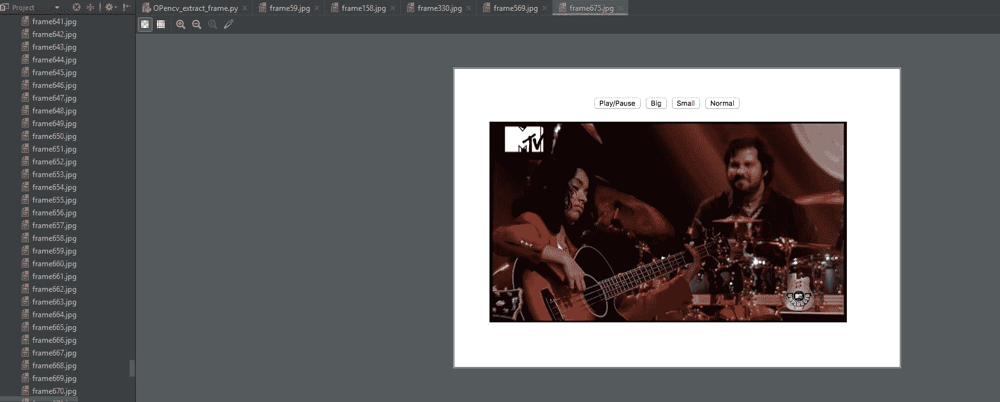

# Python |使用 OpenCV 提取帧的程序

> 原文:[https://www . geesforgeks . org/python-program-extract-frames-use-opencv/](https://www.geeksforgeeks.org/python-program-extract-frames-using-opencv/)

**[OpenCV](https://www.geeksforgeeks.org/tag/opencv/)** 自带很多强大的视频编辑功能。在目前的场景下，图像扫描、人脸识别等技术都可以使用 OpenCV 来完成。

OpenCv 库可以用来对视频进行多种操作。让我们尝试使用 CV2 做一些有趣的事情。以视频为输入，将视频逐帧分割并保存。现在，可以对这些帧执行许多操作。比如反转视频文件或者裁剪视频等等。对于以反向模式播放视频，我们只需要将帧存储在列表中，并在帧列表中反向迭代。使用列表的反转方法反转列表中帧的顺序。

**使用的功能:**

> `**VideoCapture(File_path) :**`读取视频(. mp4 格式)
> 
> `**read() :**`根据调用的对象类型读取数据
> 
> `**imwrite(filename, img[, params]) :**`将图像保存到指定文件。

下面是实现:

```py
# Program To Read video
# and Extract Frames
import cv2

# Function to extract frames
def FrameCapture(path):

    # Path to video file
    vidObj = cv2.VideoCapture(path)

    # Used as counter variable
    count = 0

    # checks whether frames were extracted
    success = 1

    while success:

        # vidObj object calls read
        # function extract frames
        success, image = vidObj.read()

        # Saves the frames with frame-count
        cv2.imwrite("frame%d.jpg" % count, image)

        count += 1

# Driver Code
if __name__ == '__main__':

    # Calling the function
    FrameCapture("C:\\Users\\Admin\\PycharmProjects\\project_1\\openCV.mp4")
```

**输出:**
