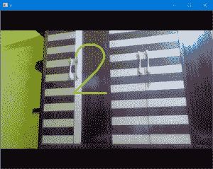

# 设置倒计时定时器使用 Python-OpenCV

捕捉图像

> 原文:[https://www . geesforgeks . org/set-倒计时-计时器-捕捉-图像-使用-python-opencv/](https://www.geeksforgeeks.org/set-countdown-timer-to-capture-image-using-python-opencv/)

**先决条件:**[OpenCV 简介](https://www.geeksforgeeks.org/introduction-to-opencv/)

我们大多数人已经用手机的倒计时器捕捉到了图像。借助 **OpenCV** ，我们可以在电脑上做同样的事情。

但是在这里我们可以指定倒计时定时器，而不是选择一个指定的倒计时，每当特定的键被按下时(比如说 **q** )，倒计时定时器就会启动，我们将借助 cv2.putText()功能在我们的相机上显示倒计时，当它达到零时，我们将捕获图像，显示固定秒数的捕获图像(根据我们的需要)，并将图像写入/保存在磁盘上。现在让我们看看如何执行这个任务:

**进场:**

*   首先，我们将在秒内设置倒计时定时器的初始值。(我们也可以将此作为用户的输入)。
*   打开摄像机，使用[**cv2 创建视频采集对象。**](https://www.geeksforgeeks.org/python-opencv-capture-video-from-camera/) 【视频拍摄】。
*   当摄像机打开时
    *   我们将阅读每一帧，并使用 [**cv2.imshow()**](https://www.geeksforgeeks.org/python-opencv-cv2-imshow-method/) 进行显示。
    *   现在我们设置一个键(我们用 **q** )开始倒计时。
    *   一按下这个键，我们就开始倒计时。
    *   我们将借助 [**time.time()**](https://www.geeksforgeeks.org/python-time-time-method/) 功能记录倒计时，并使用[**cv2 . puttext()**](https://www.geeksforgeeks.org/python-opencv-cv2-puttext-method/)**功能在视频上显示倒计时。**
    *   **当到达**零点**时，我们将复制当前帧，**使用[**cv2 . imwrite()**](https://www.geeksforgeeks.org/python-opencv-cv2-imwrite-method/)**功能将当前帧**写入磁盘上的所需位置。****
    *   ****按下**‘Esc’**后，我们将关闭摄像头。****

****下面是实现。****

## ****蟒蛇 3****

```py
**import cv2
import time

# SET THE COUNTDOWN TIMER
# for simplicity we set it to 3
# We can also take this as input
TIMER = int(20)

# Open the camera
cap = cv2.VideoCapture(0)

while True:

    # Read and display each frame
    ret, img = cap.read()
    cv2.imshow('a', img)

    # check for the key pressed
    k = cv2.waitKey(125)

    # set the key for the countdown
    # to begin. Here we set q
    # if key pressed is q
    if k == ord('q'):
        prev = time.time()

        while TIMER >= 0:
            ret, img = cap.read()

            # Display countdown on each frame
            # specify the font and draw the
            # countdown using puttext
            font = cv2.FONT_HERSHEY_SIMPLEX
            cv2.putText(img, str(TIMER),
                        (200, 250), font,
                        7, (0, 255, 255),
                        4, cv2.LINE_AA)
            cv2.imshow('a', img)
            cv2.waitKey(125)

            # current time
            cur = time.time()

            # Update and keep track of Countdown
            # if time elapsed is one second
            # than decrease the counter
            if cur-prev >= 1:
                prev = cur
                TIMER = TIMER-1

        else:
            ret, img = cap.read()

            # Display the clicked frame for 2
            # sec.You can increase time in
            # waitKey also
            cv2.imshow('a', img)

            # time for which image displayed
            cv2.waitKey(2000)

            # Save the frame
            cv2.imwrite('camera.jpg', img)

            # HERE we can reset the Countdown timer
            # if we want more Capture without closing
            # the camera

    # Press Esc to exit
    elif k == 27:
        break

# close the camera
cap.release()

# close all the opened windows
cv2.destroyAllWindows()**
```

******输出:******

********