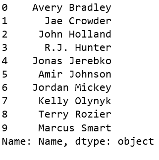
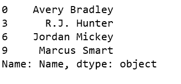
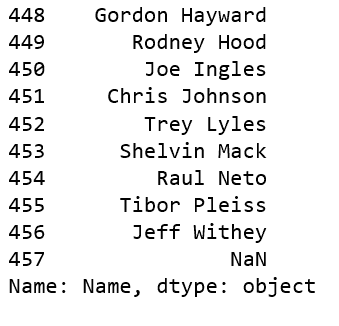

# 获取熊猫系列的元素

> 原文:[https://www . geesforgeks . org/access-熊猫系列的元素/](https://www.geeksforgeeks.org/access-the-elements-of-a-series-in-pandas/)

熊猫系列是一个一维标记数组，能够保存任何类型的数据(整数、字符串、浮点、python 对象等)。).标签不必是唯一的，但必须是可散列的类型。

让我们讨论访问给定熊猫系列元素的不同方法。

首先创建一个熊猫系列。

```
# importing pandas module 
import pandas as pd 

# making data frame 
df = pd.read_csv("https://media.geeksforgeeks.org/wp-content/uploads/nba.csv") 

ser = pd.Series(df['Name'])
ser.head(10)
# or simply df['Name'].head(10)
```

**输出:**


**例#1:** 获取系列第一个元素

```
# importing pandas module 
import pandas as pd 

# making data frame 
df = pd.read_csv("https://media.geeksforgeeks.org/wp-content/uploads/nba.csv") 

df['Name'].head(10)

# get the first element
ser[0]
```

**输出:**


**示例#2:** 通过提供项目的位置来访问多个元素

```
# importing pandas module 
import pandas as pd 

# making data frame 
df = pd.read_csv("https://media.geeksforgeeks.org/wp-content/uploads/nba.csv") 

df['Name'].head(10)

# get multiple elements at given index
ser[[0, 3, 6, 9]]
```

**输出:**


**示例#3:** 访问序列中的前 5 个元素

```
# importing pandas module 
import pandas as pd 

# making data frame 
df = pd.read_csv("https://media.geeksforgeeks.org/wp-content/uploads/nba.csv") 

df['Name'].head(10)

# get first five names
ser[:5]
```

**输出:**


**例#4:** 获取系列最后 10 个元素

```
# importing pandas module 
import pandas as pd 

# making data frame 
df = pd.read_csv("https://media.geeksforgeeks.org/wp-content/uploads/nba.csv") 

df['Name'].head(10)

# get last 10 names
ser[-10:]
```

**输出:**


**示例 5:** 通过提供索引标签来访问多个元素

```
# importing pandas module 
import pandas as pd 
import numpy as np

ser = pd.Series(np.arange(3, 15), index = list("abcdefghijkl"))

ser[['a', 'd', 'g', 'l']]
```

**输出:**
