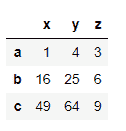

# 对熊猫数据框中的单个或选定的列或行应用功能

> 原文:[https://www . geesforgeks . org/apply-a-function-to-single-or-selected-columns-in-pandas-data frame/](https://www.geeksforgeeks.org/apply-a-function-to-single-or-selected-columns-or-rows-in-pandas-dataframe/)

在本文中，我们将学习对 Dataframe 中的单个或选定列或行应用函数的不同方法。我们将使用**[data frame/series . apply()](https://www.geeksforgeeks.org/python-pandas-series-apply/)**方法来应用函数。

> **语法:** Dataframe/series.apply(func，convert_dtype=True，args=()
> 
> **参数:**该方法将取以下参数:
> **func:** 取一个函数，应用于熊猫系列的所有值。
> **convert_dtype:** 根据函数的操作转换 dtype。
> **args=():** 要传递给函数而不是序列的附加参数。
> 
> **应用功能/操作后返回类型:**熊猫系列。

**方法 1:** 使用`Dataframe.apply()`和`lambda function`。
**例 1:** 为柱

```py
# import pandas and numpy library
import pandas as pd
import numpy as np

# List of Tuples
matrix = [(1, 2, 3),
          (4, 5, 6),
          (7, 8, 9)
         ]

# Create a DataFrame object
df = pd.DataFrame(matrix, columns = list('xyz'), 
                  index = list('abc'))

# Apply function numpy.square() to lambda
# to find the squares of the values of 
# column whose column name is 'z'
new_df = df.apply(lambda x: np.square(x) if x.name == 'z' else x)

# Output
new_df
```

**输出:**


**例 2:** 为行。

```py
# import pandas and numpy library
import pandas as pd
import numpy as np
# List of Tuples
matrix = [(1, 2, 3),
          (4, 5, 6),
          (7, 8, 9)
         ]

# Create a DataFrame object
df = pd.DataFrame(matrix, columns = list('xyz'), 
                   index = list('abc'))

# Apply function numpy.square() to lambda 
# to find the squares of the values of row
# whose row index is 'b'
new_df = df.apply(lambda x: np.square(x) if x.name == 'b' else x, 
                axis = 1)

# Output
new_df
```

**输出:**


**方法二:**使用`Dataframe/series.apply()` &【运算符】。

**例 1:** 为柱。

```py
# import pandas and numpy library
import pandas as pd
import numpy as np

# List of Tuples
matrix = [(1, 2, 3),
          (4, 5, 6),
          (7, 8, 9)
         ]

# Create a DataFrame object
df = pd.DataFrame(matrix, columns = list('xyz'), 
                   index = list('abc'))

# Apply a function to one column 'z'
# and assign it back to the same column 
df['z'] = df['z'].apply(np.square)

# Output
df
```

**输出:**


**例 2:** 为行。

```py
# import pandas and numpy library
import pandas as pd
import numpy as np

# List of Tuples
matrix = [(1, 2, 3),
          (4, 5, 6),
          (7, 8, 9)
         ]

# Create a DataFrame object
df = pd.DataFrame(matrix, columns = list('xyz'), 
                  index = list('abc'))

# Apply a function to one row 'b' 
# and assign it back to the same row 
df.loc['b'] = df.loc['b'].apply(np.square)

# Output
df
```

**输出:**


**方法三:**使用`numpy.square()`方法和`[ ]`算子。
**例 1:** 为柱

```py
# import pandas and numpy library
import pandas as pd
import numpy as np

# List of Tuples
matrix = [(1, 2, 3),
          (4, 5, 6),
          (7, 8, 9)
         ]

# Create a DataFrame object
df = pd.DataFrame(matrix, columns = list('xyz'), 
                  index = list('abc'))

# Apply a function to one column 'z' and 
# assign it back to the same column 
df['z'] = np.square(df['z'])

# Output
print(df)
```

**输出:**


**例 2:** 为行。

```py
# import pandas and numpy library
import pandas as pd
import numpy as np

# List of Tuples
matrix = [(1, 2, 3),
          (4, 5, 6),
          (7, 8, 9)
         ]

# Create a DataFrame object
df = pd.DataFrame(matrix, columns = list('xyz'), index = list('abc'))

# Apply a function to one row 'b' and 
# assign it back to the same row
df.loc['b'] = np.square(df.loc['b'])

# Output
df
```

**产量:**


**我们还可以将函数应用于数据框中的多列或多行。**

**实施例 1:** 对于柱

```py
# import pandas and numpy library
import pandas as pd
import numpy as np

# List of Tuples
matrix = [(1, 2, 3),
          (4, 5, 6),
          (7, 8, 9)
         ]

# Create a DataFrame object
df = pd.DataFrame(matrix, columns = list('xyz'), 
                  index = list('abc'))

# Apply function numpy.square() 
# for square the values of
# two columns 'x' and 'y' 
new_df = df.apply(lambda x: np.square(x) if x.name in ['x', 'y'] else x)

# Output
new_df
```

**输出:**


**例 2:** 为行。

```py
# import pandas and numpy library
import pandas as pd
import numpy as np

# List of Tuples
matrix = [(1, 2, 3),
          (4, 5, 6),
          (7, 8, 9)
         ]

# Create a DataFrame object
df = pd.DataFrame(matrix, columns = list('xyz'),
                  index = list('abc'))

# Apply function numpy.square() to 
# square the values of two rows 
# 'b' and 'c'
new_df = df.apply(lambda x: np.square(x) if x.name in ['b', 'c'] else x,
                 axis = 1)

# Output
new_df
```

**输出:**
