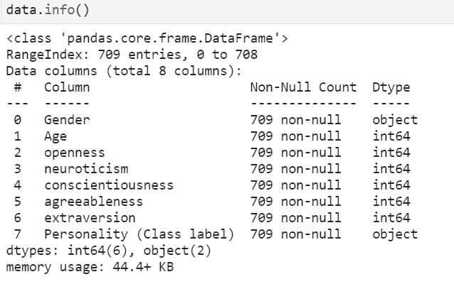
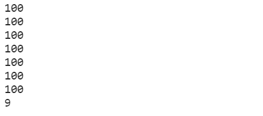
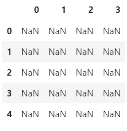

# 绕过熊猫的记忆限制

> 原文:[https://www . geesforgeks . org/bypass-pandas-memory-limits/](https://www.geeksforgeeks.org/bypassing-pandas-memory-limitations/)

Pandas 是一个用于分析和操作数据集的 Python 库，但是 Pandas 的一个主要缺点是在处理大型数据集时的内存限制问题，因为 Pandas 数据帧(二维数据结构)保存在内存中，所以一次可以处理的数据量是有限的。

**正在使用的数据集:** [train_dataset](https://media.geeksforgeeks.org/wp-content/cdn-uploads/20210428194238/train_dataset.csv)

 

在熊猫中处理大量数据需要以下方法之一:

### **方法 1:分块加载数据**

[**pandas . read _ CSV()**](https://www.geeksforgeeks.org/python-read-csv-using-pandas-read_csv/)有一个名为 chunksize 的参数，用于[在 chunk](https://www.geeksforgeeks.org/how-to-load-a-massive-file-as-small-chunks-in-pandas/)中加载数据。参数 chunksize 是熊猫一次在文件中读取的行数。它返回一个迭代器 TextFileReader，需要对它进行迭代来获取数据。

**语法:**

> pd.read_csv('file_name '，chunksize= size_of_chunk)

**示例:**

## 蟒蛇 3

```
import pandas as pd

data = pd.read_csv('train dataset.csv', chunksize=100)

for x in data:
    print(x.shape[0])
```

**输出:**



### **方法二:过滤掉有用的数据**

大型数据集有许多列/要素，但实际上只使用了其中的一部分。因此，为了节省更多的数据操作和计算时间，只加载有用的列。

**语法:**

> dataframe = dataframe[['column_1 '，' column_2 '，' column_3 '，' column_4 '，' column_5']]

**示例:**

## 蟒蛇 3

```
import pandas as pd

data=pd.read_csv('train_dataset.csv')

data = data[['Gender', 'Age', 'openness', 'neuroticism',
             'conscientiousness', 'agreeableness', 'extraversion']]

display(data)
```

**输出:**


### **方法 3:为列指定数据类型**

默认情况下，pandas 为所有数值分配 int64 范围(这是最大的可用数据类型)。但是如果数值列中的值小于 int64 范围，那么较小容量的[数据类型](https://www.geeksforgeeks.org/python-pandas-dataframe-dtypes/)可以用来防止额外的内存分配，因为较大的数据类型使用更多的内存。

**语法:**

> data frame = PD . read _ CSV(' file _ name '，dtype={'col_1':'dtype_value '，' col_2':'dtype_value'})

**示例:**

## 蟒蛇 3

```
import pandas as pd

data = pd.read_csv('train_dataset.csv', dtype={'Age': 'int32'})

print(data.info())
```

**输出:**


### **方法 4:稀疏数据结构**

熊猫数据帧可以转换为稀疏数据帧，这意味着任何与特定值匹配的数据都将在表示中被省略。稀疏数据帧允许更高效的存储。

**语法:**

> data frame = data frame . to _ sparse(fill _ value = None，kind='block ')

由于上面的数据集中没有空值，让我们用一些空值创建数据帧，并将其转换为稀疏数据帧。

**示例:**

## 蟒蛇 3

```
import pandas as pd
import numpy as np

df = pd.DataFrame(np.random.randn(10000, 4))
df.iloc[:9998] = np.nan

sdf = df.astype(pd.SparseDtype("float", np.nan))

sdf.head()

sdf.dtypes
```

**输出:**

 

### **方法 5:删除未使用的对象**

当数据清理/预处理时，会创建许多临时数据帧和对象，这些数据帧和对象在使用后应该被删除，以便使用更少的内存。python 中的 [del](https://www.geeksforgeeks.org/python-del-to-delete-objects/) 关键字主要用于删除 Python 中的对象。

**语法:**

> del 对象名称

**示例:**

## 蟒蛇 3

```
import pandas as pd

data = pd.read_csv('train_dataset.csv')

del data
```