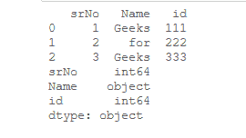

# 更改一列或熊猫系列的数据类型

> 原文:[https://www . geesforgeks . org/change-the-data-type-of-a-column-or-a-pandas-series/](https://www.geeksforgeeks.org/change-the-data-type-of-a-column-or-a-pandas-series/)

[**系列**](https://www.geeksforgeeks.org/python-pandas-series/) 是一维标记数组，能够保存整数、字符串、浮点、python 对象等类型的数据。轴标签统称为索引。

让我们看看在熊猫数据框中改变列或系列数据类型的程序。
**方法 1:** 使用[**data frame . astype()**](https://www.geeksforgeeks.org/python-pandas-dataframe-astype/)方法。

我们可以传递任何 Python、Numpy 或 Pandas 数据类型来将数据框的所有列更改为该类型，或者我们可以传递以列名作为键、以数据类型作为值的字典来更改所选列的类型。

> **语法:** DataFrame.astype(dtype，copy = True，errors = 'raise '，**kwargs)
> 
> **返回:**铸造:来电者类型

让我们看看例子:
**例子 1:** 列的数据类型改为“str”对象。

## 蟒蛇 3

```
# importing the pandas library
import pandas as pd

# creating a DataFrame
df = pd.DataFrame({'srNo': [1, 2, 3],
                   'Name': ['Geeks', 'for', 
                            'Geeks'], 
                   'id': [111, 222, 
                          333]})
# show the dataframe
print(df)

# show the datatypes
print(df.dtypes)
```

**输出:**



现在，将 dataframe 数据类型更改为 string。

## 蟒蛇 3

```
# changing the dataframe 
# data types to string
df = df.astype(str)

# show the data types 
# of dataframe
df.dtypes
```