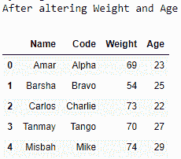

# 更改 Python 中熊猫数据框列的顺序

> 原文:[https://www . geesforgeks . org/change-the-order-a-pandas-data frame-columns-in-python/](https://www.geeksforgeeks.org/change-the-order-of-a-pandas-dataframe-columns-in-python/)

让我们看看如何改变数据框的列顺序。

**算法:**

*   创建一个数据帧。
*   使用更改的列顺序重新分配相同的数据框。
*   打印数据帧。

**例 1 :**

## 蟒蛇 3

```py
# importing the modules
import pandas as pd
import numpy as np

# creating the DataFrame
my_data = {'Sr.no': [1, 2, 3, 4, 5],
           'Name': ['Ram', 'Sham', 'Sonu',
                    'Tinu', 'Monu'],
           'Maths Score': [45, 67, 89, 74, 56]}
df = pd.DataFrame(data = my_data)

# printing the original DataFrame
print("My Original DataFrame")
print(df)

# altering the DataFrame
df = df[['Sr.no', 'Maths Score', 'Name']]

# printing the altered DataFrame
print('After altering Name and Maths Score')
print(df)
```

输出:


**例 2 :**

## 蟒蛇 3

```py
# importing the modules
import pandas as pd

# creating the DataFrame
l1 =["Amar", "Barsha", "Carlos", "Tanmay", "Misbah"]
l2 =["Alpha", "Bravo", "Charlie", "Tango", "Mike"]
l3 =[23, 25, 22, 27, 29]
l4 =[69, 54, 73, 70, 74]
df = pd.DataFrame(list(zip(l1, l2, l3, l4)))
df.columns =['Name', 'Code', 'Age', 'Weight']

# printing the original DataFrame
print("My Original DataFrame")
print(df)

# altering the DataFrame
df = df[['Name', 'Code', 'Weight', 'Age']]

# printing the altered DataFrame
print('After altering Weight and Age')
print(df)
```

**输出:**


