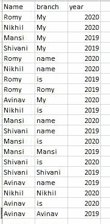
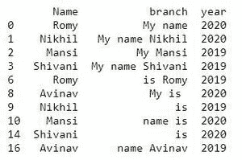

# 使用 Pandas groupby

连接多行字符串

> 原文:[https://www . geeksforgeeks . org/concatenate-strings-from-from-from-row-using-pandas-group by/](https://www.geeksforgeeks.org/concatenate-strings-from-several-rows-using-pandas-groupby/)

熊猫[**data frame . group by()**](https://www.geeksforgeeks.org/python-pandas-dataframe-groupby/)方法用于根据一些标准将数据分成组。分组的抽象定义是提供标签到组名的映射。

要使用 **Dataframe.groupby()** 连接多行字符串，请执行以下步骤:

1.  使用 Dataframe.groupby()方法对数据进行分组，您需要连接该方法的属性。
2.  使用连接函数连接字符串，并使用[**【λ】**](https://www.geeksforgeeks.org/python-lambda-anonymous-functions-filter-map-reduce/)语句转换该列的值。

我们将使用具有 2 列的 [CSV 文件](https://drive.google.com/file/d/19V2l50vvZwAeAqKiVG1mKKQJ3tWnOztT/view)，该文件的内容如下图所示:


**示例 1:** 我们将连接同名分支列中的数据。

## 蟒蛇 3

```
# import pandas library
import pandas as pd

# read csv file
df = pd.read_csv("Book2.csv")

# concatenate the string
df['branch'] = df.groupby(['Name'])['branch'].transform(lambda x : ' '.join(x))

# drop duplicate data
df = df.drop_duplicates()   

# show the dataframe
print(df)
```

**输出:**


**示例 2:** 我们还可以在多列上执行 Pandas groupby。

我们将使用具有 3 列的 [CSV 文件](https://drive.google.com/file/d/1BL4wrOrt00V9xuVWkeJk8wab5zzw2PrL/view)，该文件的内容如下图所示:



在“姓名”和“年份”列上应用 groupby

## 蟒蛇 3

```
# import pandas library
import pandas as pd

# read a csv file
df = pd.read_csv("Book1.csv")

# concatenate the string
df['branch'] = df.groupby(['Name', 'year'])['branch'].transform(
                                              lambda x: ' '.join(x))

# drop duplicate data
df = df.drop_duplicates()          

# show the dataframe
df
```

**输出:**

