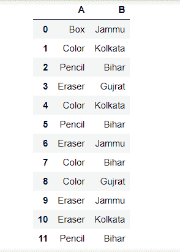
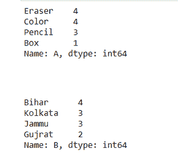

# 统计熊猫数据框中项目集的出现频率

> 原文:[https://www . geesforgeks . org/count-pandas-data frame 中的项目集频率/](https://www.geeksforgeeks.org/count-frequency-of-itemsets-in-pandas-dataframe/)

在本文中，我们将解释如何计算熊猫给定数据帧中的项目集频率。使用 count()、size()方法、Series.value_counts()和 pandas。Index.value_counts()方法我们可以统计给定 DataFrame 中项目集的出现频率。在这里，我们将解释如何在实践中使用这些函数的几个例子。

**原始数据:**



**例 1:**

使用 **Series.value_counts():** 此方法适用于熊猫。系列对象。由于每个 DataFrame 对象都是 Series 对象的集合，因此我们可以应用此方法来获取一列中值的频率计数。

## 蟒蛇 3

```py
import pandas as pd

df = pd.DataFrame({
    'A': ['Box', 'Color', 'Pencil', 'Eraser', 
          'Color', 'Pencil', 'Eraser', 'Color', 
          'Color', 'Eraser', 'Eraser', 'Pencil'],

    'B': ['Jammu', 'Kolkata', 'Bihar', 'Gujrat',
          'Kolkata', 'Bihar', 'Jammu', 'Bihar',
          'Gujrat', 'Jammu', 'Kolkata', 'Bihar']
})

count = df['A'].value_counts()
display(count)

count = df['B'].value_counts()
display(count)
```

**输出:**



**示例 2:** 使用**熊猫数据框大小()**

它返回元素的总数，通过将 shape 方法返回的行和列相乘进行比较。

## 蟒蛇 3

```py
import pandas as pd

df = pd.DataFrame({
    'A': ['Box', 'Color', 'Pencil', 'Eraser',
          'Color', 'Pencil', 'Eraser', 'Color',
          'Color', 'Eraser', 'Eraser', 'Pencil'],

    'B': ['Jammu', 'Kolkata', 'Bihar', 'Gujrat', 
          'Kolkata', 'Bihar', 'Jammu', 'Bihar',
          'Gujrat', 'Jammu', 'Kolkata', 'Bihar']
})

freq = df.groupby(['A']).size()
display(freq)

freq = df.groupby(['B']).size()
display(freq)
```