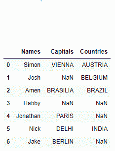

# 计算熊猫数据框中一列或多列的 NaN 值

> 原文:[https://www . geeksforgeeks . org/count-the-nan-values-in-in-columns-pandas-data frame/](https://www.geeksforgeeks.org/count-the-nan-values-in-one-or-more-columns-in-pandas-dataframe/)

让我们看看如何计算熊猫数据帧中一列或多列的 NaN 值的总数。为了计算数据帧中的 NaN 值，我们需要为数据帧分配一个字典，该字典应该包含 `numpy.nan`值，即`NaN(null)`值。

考虑以下数据帧。

```py
# importing the modules
import numpy as np
import pandas as pd

# creating the DataFrame
dictionary = {'Names': ['Simon', 'Josh', 'Amen', 
                        'Habby', 'Jonathan', 'Nick', 'Jake'],
              'Capitals': ['VIENNA', np.nan, 'BRASILIA', 
                           np.nan, 'PARIS', 'DELHI', 'BERLIN'],
              'Countries': ['AUSTRIA', 'BELGIUM', 'BRAZIL', 
                            np.nan, np.nan, 'INDIA', np.nan]}
table = pd.DataFrame(dictionary, columns = ['Names', 
                                           'Capitals', 
                                           'Countries'])

# displaying the DataFrame
display(table)
```

**输出:**


**例 1 :** 计算单列中的 NaN 值。

```py
print("Number of null values in column 1 : " + 
       str(table.iloc[:, 1].isnull().sum()))
print("Number of null values in column 2 : " + 
       str(table.iloc[:, 2].isnull().sum()))
```

**输出:**

```py
Number of null values in column 1 : 2
Number of null values in column 2 : 3

```

**例 2 :** 计算单行中的 NaN 值。

```py
print("Number of null values in row 0 : " + 
       str(table.iloc[0, ].isnull().sum()))
print("Number of null values in row 1 : " + 
       str(table.iloc[1, ].isnull().sum()))
print("Number of null values in row 3 : " + 
       str(table.iloc[3, ].isnull().sum()))
```

**输出:**

```py
Number of null values in row 0 : 0
Number of null values in row 1 : 1
Number of null values in row 3 : 2

```

**示例 3 :** 计算数据帧中的总 NaN 值。

```py
print("Total Number of null values in the DataFrame : " + 
       str(table.isnull().sum().sum()))
```

**输出:**

```py
Total Number of null values in the DataFrame : 5

```

**示例 4 :** 计算所有列中的 NaN 值。

```py
display(table.isnull().sum())
```

**输出:**
