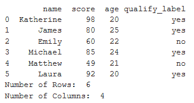
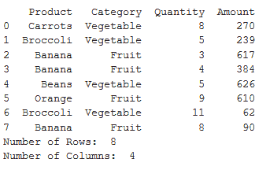
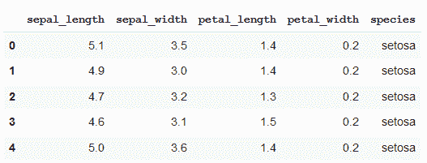

# 计算熊猫数据框的行数和列数

> 原文:[https://www . geeksforgeeks . org/count-熊猫的行数和列数-dataframe/](https://www.geeksforgeeks.org/count-the-number-of-rows-and-columns-of-a-pandas-dataframe/)

熊猫允许我们通过计算数据框中的行数和列数来获得数据框的形状。您可以尝试各种方法来获取数据框的行数和列数。所有这些都在下面讨论。

**例:**我们举一个由学生考试成绩数据组成的数据框架的例子。

```py
# importing pandas 
import pandas as pd
result_data = {'name': ['Katherine', 'James', 'Emily',
                        'Michael', 'Matthew', 'Laura'],
        'score': [98, 80, 60, 85, 49, 92],
        'age': [20, 25, 22, 24, 21, 20],
        'qualify_label': ['yes', 'yes', 'no',
                          'yes', 'no', 'yes']}

# creating dataframe
df = pd.DataFrame(result_data, index = None)

# computing number of rows
rows = len(df.axes[0])

# computing number of columns
cols = len(df.axes[1])

print(df)
print("Number of Rows: ", rows)
print("Number of Columns: ", cols)
```

**输出:**


**示例:**我们举一个由产品销售数据组成的数据框架的例子。

```py
# importing pandas 
import pandas as pd

# creating dataframe
df = pd.DataFrame({'Product' : ['Carrots', 'Broccoli', 'Banana', 
                                'Banana', 'Beans', 'Orange',
                                'Broccoli', 'Banana'],
                   'Category' : ['Vegetable', 'Vegetable', 'Fruit', 
                                 'Fruit', 'Vegetable', 'Fruit', 
                                 'Vegetable', 'Fruit'],
                   'Quantity' : [8, 5, 3, 4, 5, 9, 11, 8],
                   'Amount' : [270, 239, 617, 384, 626, 610, 62, 90]})

print(df)

# getting number of rows
print("Number of Rows: ", len(df.axes[0]))

# getting number of columns
print("Number of Columns: ", len(df.axes[1]))
```

**输出:**


**示例:**这里，我们将尝试一种不同的方法来计算导入的 csv 文件的数据帧的行和列。

```py
# importing pandas
import pandas as pd

# importing csv file
df = pd.read_csv('https://raw.githubusercontent.com/uiuc-cse/data-fa14/gh-pages/data/iris.csv')

print(df.head())

# obtaining the shape
print("shape of dataframe", df.shape)

# obtaining the number of rows
print("number of rows : ", df.shape[0])

# obtaining the number of columns
print("number of columns : ", df.shape[1])
```

**输出:**


