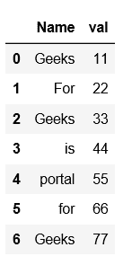
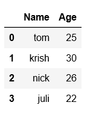
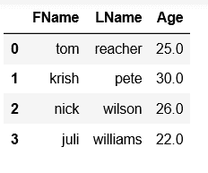

# 从列表中创建熊猫数据框

> 原文:[https://www . geesforgeks . org/create-a-pandas-data frame-from-list/](https://www.geeksforgeeks.org/create-a-pandas-dataframe-from-lists/)

Python 是进行数据分析的优秀语言，主要是因为以数据为中心的 python 包的奇妙生态系统。Pandas 就是其中之一，它让数据的导入和分析变得更加容易。

创建熊猫数据框可以通过多种方式实现。让我们看看如何从列表中创建熊猫数据帧。

**代码#1:** 基本示例

```
# import pandas as pd
import pandas as pd

# list of strings
lst = ['Geeks', 'For', 'Geeks', 'is', 
            'portal', 'for', 'Geeks']

# Calling DataFrame constructor on list
df = pd.DataFrame(lst)
df
```

**输出:**


**代码#2:** 使用带有索引和列名的列表的数据帧

```
# import pandas as pd
import pandas as pd

# list of strings
lst = ['Geeks', 'For', 'Geeks', 'is', 'portal', 'for', 'Geeks']

# Calling DataFrame constructor on list
# with indices and columns specified
df = pd.DataFrame(lst, index =['a', 'b', 'c', 'd', 'e', 'f', 'g'],
                                              columns =['Names'])
df
```

**输出:**


**代码#3:** 使用 zip()来压缩两个列表

```
# import pandas as pd
import pandas as pd

# list of strings
lst = ['Geeks', 'For', 'Geeks', 'is', 'portal', 'for', 'Geeks']

# list of int
lst2 = [11, 22, 33, 44, 55, 66, 77]

# Calling DataFrame constructor after zipping
# both lists, with columns specified
df = pd.DataFrame(list(zip(lst, lst2)),
               columns =['Name', 'val'])
df
```

**输出:**


**代码#4:** 使用多维列表创建数据框

```
# import pandas as pd
import pandas as pd 

# List1 
lst = [['tom', 25], ['krish', 30],
       ['nick', 26], ['juli', 22]]

df = pd.DataFrame(lst, columns =['Name', 'Age'])
df
```

**输出:**


**代码#5:** 使用指定了列名和数据类型的多维列表。

```
# import pandas as pd
import pandas as pd 

# List1 
lst = [['tom', 'reacher', 25], ['krish', 'pete', 30],
       ['nick', 'wilson', 26], ['juli', 'williams', 22]]

df = pd.DataFrame(lst, columns =['FName', 'LName', 'Age'], dtype = float)
df
```

**输出:**


**代码#6:** 使用字典中的列表创建数据帧

```
# importing pandas as pd 
import pandas as pd 

# list of name, degree, score
nme = ["aparna", "pankaj", "sudhir", "Geeku"]
deg = ["MBA", "BCA", "M.Tech", "MBA"]
scr = [90, 40, 80, 98]

# dictionary of lists 
dict = {'name': nme, 'degree': deg, 'score': scr} 

df = pd.DataFrame(dict)

df 
```

**输出:**
