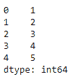

# 使用 Python 中的 Pandas 创建并显示一维数组状对象

> 原文:[https://www . geesforgeks . org/create-and-display-一维数组状对象-使用 python 中的熊猫/](https://www.geeksforgeeks.org/create-and-display-a-one-dimensional-array-like-object-using-pandas-in-python/)

**Series()** 是 Pandas 库中存在的一个函数，它创建一个一维数组，并且可以在其中保存任何类型的对象或数据。在本文中，让我们学习语法，使用 Pandas 库创建和显示包含数据数组的一维数组状对象。

## 熊猫。系列()

> **语法:**熊猫。
> 系列(参数)**参数:**
> 
> *   **数据:**包含存储在序列中的数据。
> *   **索引:**值必须是可散列的，并且具有与数据相同的长度。
> *   **数据类型:**输出序列的数据类型。
> *   **名称:**给予系列的名称。
> *   **复制:**复制输入数据。
> 
> **返回:**系列类的一个对象

**示例 1 :** 从列表创建系列

```
# import the library
import pandas as pd

# create the one-dimensional array
data = [1, 2, 3, 4, 5]

# create the Series
ex1 = pd.Series(data)

# displaying the Series
print(ex1)
```

**输出:**


**示例 2 :** 从 NumPy 数组创建系列。

```
# import the pandas and numpy library
import pandas as pd
import numpy as np

# create numpy array
data = np.array(['a', 'b', 'c', 'd'])

# create one-dimensional data
s = pd.Series(data)

# display the Series
print(s)
```

**输出:**


**示例 3:** 从字典创建系列。

```
# import the pandas library
import pandas as pd

# create dictionary
dict = {'a' : 0.1, 'b' : 0.2, 'c' : 0.3}

# create one-dimensional data
s = pd.Series(dict)

# display the Series
print(s)
```

**输出:**


**示例 4 :** 从列表列表创建系列。

```
# importing the module
import pandas as pd

# creating the data
data = [['g', 'e', 'e', 'k', 's'],
        ['f', 'o', 'r'],
        ['g', 'e', 'e', 'k', 's']]

# creating a Pandas series of lists
s = pd.Series(data)

# displaying the Series
print(s)
```

**输出:**
