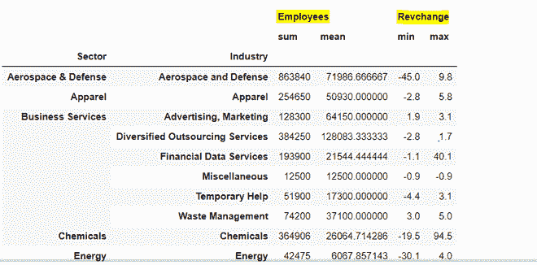
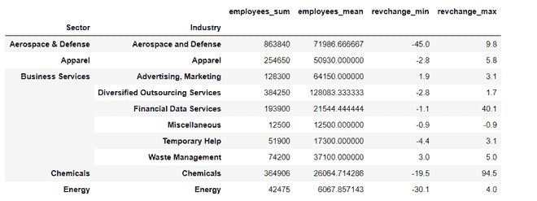
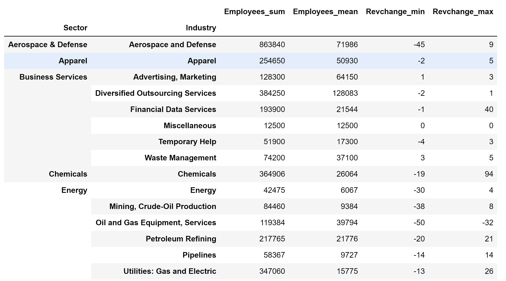
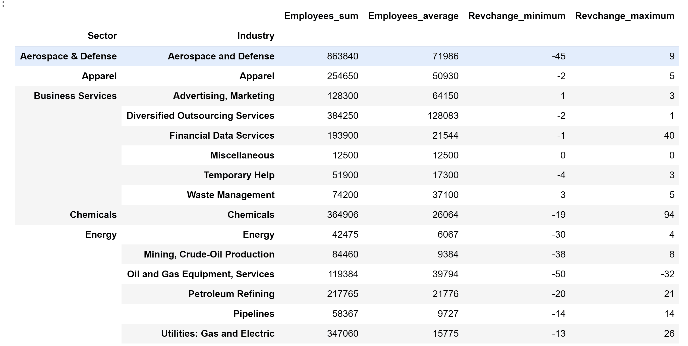

# 通过模块

创建熊猫分组的非层级列

> 原文:[https://www . geeksforgeeks . org/create-非分层-带熊猫的列-按模块分组/](https://www.geeksforgeeks.org/create-non-hierarchical-columns-with-pandas-group-by-module/)

在本文中，我们将看到在应用 **groupby** 模块时创建非分层列的两种方法。

我们正在使用财富 500 强公司数据集来演示问题和解决方案。我们得从 [data.world](https://data.world/aurielle/fortune-500-2017) 网站上抢一份。

对于每个“部门”和“行业”，找出总员工数、平均员工数和最小、最大收入变化。

**我们来看一个** **实现的例子:**

**第一步:**我们先来导入熊猫和以公司“Rank”为索引的数据集。

## 蟒蛇 3

```
import pandas as pd

# load the dataset
df = pd.read_csv(
    "https://raw.githubusercontent.com/sasankac/TestDataSet/master/Fortune500.csv")

# print the columns
print(df.columns)
```

**输出:**


**步骤 2:** 数据集中有相当多的列我们不感兴趣，例如总部位置、地址……我将从数据集中删除它们。

## 蟒蛇 3

```
# remove unwanted columns 
remove_columns =['Website','Hqaddr','Hqzip', 'Hqtel',
                 'Ceo','Ceo-title', 'Address', 'Ticker',
                 'Prftchange', 'Assets', 'Totshequity']

df = df.drop(columns= remove_columns,axis = 1)
print(df.columns)
```

**输出:**


**方法 1:**

在此方法中，我们将使用 **to_flat_index** 方法输出非分层列。首先，让我对下面的数据列进行分组。对于每个“部门”和“行业”，找出总员工数、平均员工数和最小、最大收入变化。groupby 和聚合的语法如下

> **语法:** df.groupby(['分组列 1 '，'分组列 2"])。agg({ '聚合列 1' :['聚合函数 1 '，'聚合函数 2'] })

> 现在，按照要求，让我们将数据集的列名映射到语法。
> 
> *   分组栏–“部门”、“行业”
> *   汇总列-“员工”、“变更”
> *   聚合函数–“sum”、“mean”、“min”max 3。通过应用上述语法获得结果。

**实施:**

## 蟒蛇 3

```
df_result = (df
           .groupby(['Sector','Industry'])
           .agg({'Employees':['sum', 'mean'],
                 'Revchange':['min','max']}))

# printing top 15 rows
df_result.head(15)
```

**输出:**



查看结果，我们有 6 个分层列，即员工的总和和平均值(用黄色突出显示)以及 Revchange 的最小值和最大值列。我们可以使用。熊猫 0.24 版本中引入的 to_flat_index 方法。

## 蟒蛇 3

```
df_result.columns = ['_'.join(cols).lower()
                     for cols in df_result.columns.to_flat_index()]
df_result.head(10)
```

**输出:**



函数成功应用后，所有列都不会被展平，列名会附加聚合函数。

**全面实施:**

## 蟒蛇 3

```
"""
 Program: For each "Sector" and "Industry" Find the total, average employees, and the minimum, maximum revenue change.  
"""

import pandas as pd

"""
 Function: Convert hierarchial columns to non-hierarchial columns
   params: dataframe with hierarchial columns
  return : dataframe with non-hierarchial columns
"""

def return_non_hierarchial(df):
    df.columns = ['_'.join(x) for x in df.columns.to_flat_index()]
    return df

# load the dataset with rank as index
df = pd.read_csv(
    "https://raw.githubusercontent.com/sasankac/TestDataSet/master/Fortune500.csv", index_col="Rank")

# remove unwanted columns
remove_columns = ['Website', 'Hqaddr', 'Hqzip', 'Hqtel', 'Ceo',
                  'Ceo-title', 'Address', 'Ticker', 'Prftchange',
                  'Assets', 'Totshequity']

df = df.drop(columns=remove_columns, axis=1)

# Identify the data as per the requirement
df_result = (df
             .groupby(['Sector', 'Industry'])
             .agg({'Employees': ['sum', 'mean'],
                   'Revchange': ['min', 'max']})
             .astype(int)
             .pipe(return_non_hierarchial))

# print the data
df_result.head(15)
```

**输出:**



**方法二:**

熊猫引入了命名聚合对象来创建无层次的列。我将使用上面提到的相同要求，并将其应用于命名聚合。

此 groupby 方法的语法如下:

> df.groupby(['分组列 1 '，'分组列 2 '])。agg({ '命名列' = NamedAgg(列= '聚合列'，aggfunc= '聚合函数'))

**实施:**

## 蟒蛇 3

```
"""
 Program: For each "Sector" and "Industry" Find the total, average employees, and the minimum, maximum revenue change.  
"""

import pandas as pd

# load the dataset with rank as index
df = pd.read_csv(
    "https://raw.githubusercontent.com/sasankac/TestDataSet/master/Fortune500.csv", index_col="Rank")

# remove unwanted columns
remove_columns = ['Website', 'Hqaddr', 'Hqzip', 'Hqtel', 'Ceo',
                  'Ceo-title', 'Address', 'Ticker', 'Prftchange',
                  'Assets', 'Totshequity']

df = df.drop(columns=remove_columns, axis=1)

# Identify the data as per the requirement
df_result = (df
             .groupby(['Sector', 'Industry'])
             .agg(Employees_sum=pd.NamedAgg(column='Employees', aggfunc='sum'),
                  Employees_average=pd.NamedAgg(
                      column='Employees', aggfunc='mean'),
                  Revchange_minimum=pd.NamedAgg(
                      column='Revchange', aggfunc='min'),
                  Revchange_maximum=pd.NamedAgg(column='Revchange', aggfunc='max'))
             .astype(int))

# print the data
df_result.head(15)
```

**输出:**

