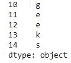
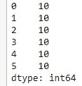
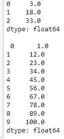

# 打造熊猫系列

> 原文:[https://www.geeksforgeeks.org/creating-a-pandas-series/](https://www.geeksforgeeks.org/creating-a-pandas-series/)

[熊猫系列](https://www.geeksforgeeks.org/python-pandas-series/)是一个一维标签数组，能够保存任何类型的数据(整数、字符串、浮点、python 对象等)。).轴标签统称为*索引*。

标签不必是唯一的，但必须是可散列的类型。该对象支持整数索引和基于标签的索引，并提供了一系列方法来执行涉及索引的操作。


**创建空系列:**
可以创建的基本系列是空系列。

```py
# import pandas as pd
import pandas as pd

# Creating empty series
ser = pd.Series()

print(ser)
```

**输出:**

```py
Series([], dtype: float64)

```

**从数组创建系列:**
为了从数组创建系列，我们必须导入一个 numpy 模块，并且必须使用 array()函数。

```py
# import pandas as pd
import pandas as pd

# import numpy as np
import numpy as np

# simple array
data = np.array(['g', 'e', 'e', 'k', 's'])

ser = pd.Series(data)
print(ser)
```

**输出:**


**用索引从数组中创建系列:**
为了用索引从数组中创建系列，我们必须为索引提供与数组中相同数量的元素。

```py
# import pandas as pd
import pandas as pd

# import numpy as np
import numpy as np

# simple array
data = np.array(['g', 'e', 'e', 'k', 's'])

# providing an index
ser = pd.Series(data, index =[10, 11, 12, 13, 14])
print(ser)
```

**输出:**



**[从 list 创建系列](https://www.geeksforgeeks.org/creating-a-pandas-series-from-lists/) :**
为了从 list 创建系列，我们必须先创建一个 list，然后才能从 list 创建系列。

```py
import pandas as pd

# a simple list
list = ['g', 'e', 'e', 'k', 's']

# create series form a list
ser = pd.Series(list)
print(ser)
```

**输出:**


**[从字典创建系列](https://www.geeksforgeeks.org/creating-a-pandas-series-from-dictionary/) :**
为了从字典创建系列，我们必须先创建一个字典，之后我们可以使用字典来制作系列。字典键用于构造索引。

```py
import pandas as pd

# a simple dictionary
dict = {'Geeks' : 10,
        'for' : 20,
        'geeks' : 30}

# create series from dictionary
ser = pd.Series(dict)

print(ser)
```

**输出:**


**从标量值创建系列:**
为了从标量值创建系列，必须提供索引。标量值将被重复以匹配索引的长度。

```py
import pandas as pd

import numpy as np

# giving a scalar value with index
ser = pd.Series(10, index =[0, 1, 2, 3, 4, 5])

print(ser)
```

**输出:**



**[使用 numpy 函数创建系列](https://www.geeksforgeeks.org/create-pandas-series-using-numpy-functions/) :**
为了使用 numpy 函数创建系列，我们可以使用不同的 NumPy 函数，如 [numpy.linspace()](https://www.geeksforgeeks.org/numpy-linspace-python/) 、 [numpy.random.radn()](https://www.geeksforgeeks.org/numpy-random-randn-python/) 。

```py
# import pandas and numpy 
import pandas as pd 
import numpy as np 

# series with numpy linspace()  
ser1 = pd.Series(np.linspace(3, 33, 3)) 
print(ser1) 

# series with numpy linspace() 
ser2 = pd.Series(np.linspace(1, 100, 10)) 
print("\n", ser2) 
```

**输出:**

