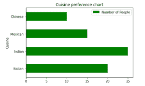

# 使用熊猫创建水平条形图

> 原文:[https://www . geesforgeks . org/creating-横条图-使用-pandas/](https://www.geeksforgeeks.org/creating-horizontal-bar-charts-using-pandas/)

**先决条件** : [熊猫](https://www.geeksforgeeks.org/pandas-tutorial/)

条形图将分类数据和相应的数据值表示为矩形条。通常，x 轴代表分类值，y 轴代表数据值或频率。这叫做垂直条形图，相反的叫做水平条形图。在某些情况下，水平条形图提供更好的可读性。

Python 有各种可视化库，比如 [Matplotlib](https://www.geeksforgeeks.org/python-introduction-matplotlib/) 和 [Seaborn](https://www.geeksforgeeks.org/introduction-to-seaborn-python/) 。与 Matplotlib 紧密集成的[熊猫](https://www.geeksforgeeks.org/pandas-tutorial/)库允许通过数据框和系列对象直接创建情节。本文探讨了使用 Pandas 创建水平条形图的方法。

使用熊猫数据框的*绘图*实例，可以创建各种图形，包括条形图。代表复杂类别的条形图有两种类型:

1.  **分组或复合条形图**–当您有一个主类别的子类别时，该图会在相应的类别中为每个变量或子类别分配一个单独的条形图。
2.  **堆叠条形图**–当您有一个主类别的子类别时，该图将子类别堆叠在彼此之上以产生一个条形。

熊猫的*条形图()*和*条形图()*方法分别绘制垂直和水平条形图。本质上，*data frame . plot(kind =“bar”)*相当于 *DataFrame.plot.bar()* 。下面是一些使用上述函数创建不同类型条形图的示例。

## 简单水平条形图

**语法:**

```py
DataFrame.plot.barh()
```

*barh()* 方法接受 x 和 y 参数，其中 x 取分类值(默认情况下，它取数据框的索引)，y 取所有数值列。 *DataFrame.plot()* 支持的关键字参数(如标题或图形大小)可以传递给 *barh()* 方法，以自定义条形图。给出了描绘水平条形图的实现，该图表示偏爱特定种类菜肴的人数。

**示例:**

## 蟒蛇 3

```py
# Import required libraries
import pandas as pd

# Create a sample dataframe
df = pd.DataFrame({'Cuisine': ['Italian', 'Indian', 'Mexican', 'Chinese'],
                   'Number of People': [20, 25, 15, 10]})

# Plot a bar chart
df.plot.barh(x='Cuisine', y='Number of People',
             title='Cuisine Preference', color='green')
```

**输出:**



## 复合水平条形图

从上面的例子中，如果人们被分成男性和女性的子群体，那么我们可以用一个复合的水平条形图来表示这个数据。这个例子显示了一个水平条形图，表示使用两种方法偏好特定种类菜肴的男性和女性的数量。

**例 2** :

条形图使用 *barh()* 方法

## 蟒蛇 3

```py
# Import required libraries
import pandas as pd

# Create a sample dataframe
df = pd.DataFrame({'Number of Males': [10, 15, 25, 14],
                   'Number of Females': [20, 25, 15, 10]},
                  index=['Italian', 'Indian', 'Mexican', 'Chinese'])

# Plot grouped horizontal bar chart
df.plot.barh(title="Gender wise Cuisine preference chart",
             color={"green", "pink"})
```

**输出:**


**例 3:**

条形图使用*绘图()*方法

## 蟒蛇 3

```py
# Import required libraries
import pandas as pd

# Create a sample dataframe
df = pd.DataFrame({'Number of Males': [10, 15, 25, 14],
                   'Number of Females': [20, 25, 15, 10]},
                  index=['Italian', 'Indian', 'Mexican', 'Chinese'])

# Plot stacked horizontal bar chart
df.plot(kind="barh", title="Gender wise Cuisine preference chart",
        color={"green", "pink"})
```

**输出:**


## 堆叠水平条形图

堆叠条形图有助于表示不同子组的组成或贡献。下面的例子显示了一个横条图，代表了男性和女性偏爱特定种类菜肴的百分比。堆叠水平条形图将数据框中每个观察点的值并排放在单个条形图中。但是，它堆叠的是数值，而不是整体的百分比。因此，我们首先将数据值转换为整体的百分比，然后使用 *barh()* 函数，将堆叠参数设置为真，以创建填充的堆叠水平条形图。

**例 4** :

## 蟒蛇 3

```py
# Import required libraries
import pandas as pd

# Create a sample dataframe
df = pd.DataFrame({'Number of Males': [10, 15, 25, 14],
                   'Number of Females': [20, 25, 15, 10]},
                  index=['Italian', 'Indian', 'Mexican', 'Chinese'])

# Convert numeric values to percentage of whole
percent_df = df.apply(lambda x: (x * 100) / sum(x), axis=1)

# Plot stacked horizontal bar chart
percent_df.plot.barh(stacked=True,
                     title="Male-Female percentage composition of Cuisine preferences")
```

**输出:**

