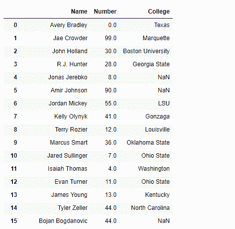
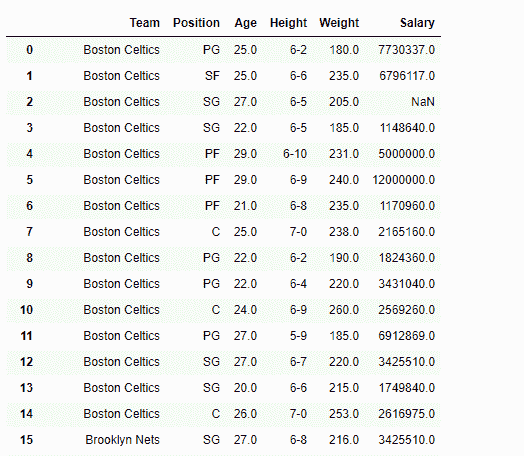
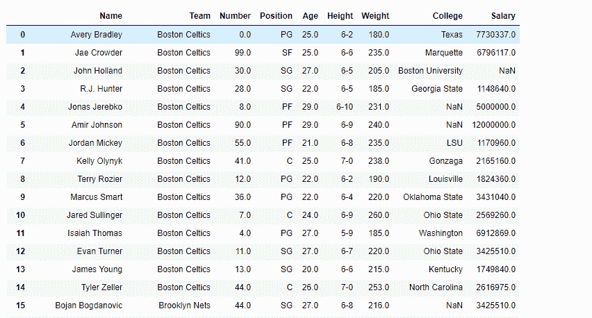

# 在熊猫数据框上创建视图|设置–2

> 原文:[https://www . geesforgeks . org/creating-view-on-pandas-data frame-set-2/](https://www.geeksforgeeks.org/creating-views-on-pandas-dataframe-set-2/)

先决条件:[在熊猫数据框上创建视图|设置–1](https://www.geeksforgeeks.org/creating-views-on-pandas-dataframe/)

很多时候，在进行数据分析时，我们所处理的大型数据集有很多属性。所有的属性不一定都同等重要。因此，我们希望只处理 dataframe 中的一组列。为此，让我们看看如何在 Dataframe 上创建视图，只选择那些我们需要的列，而留下其余的。

给定一个包含 *nba* 数据的数据框，在其上创建视图，以便只包含所需的列。

**注意:**要链接到代码中使用的 CSV 文件，请点击此处

**解决方案#1:** 将 csv 文件中的数据读入 Python 时，我们可以选择所有想要读入 DataFrame 的列。

```
# importing pandas as pd
import pandas as pd

# list of columns that we want to
# read into the DataFrame
use_cols =['Name', 'Number', 'College']

# Reading the csv file
df = pd.read_csv('nba.csv', usecols = lambda x : x in use_cols,
                                             index_col = False)

# Print the dataframe
print(df)
```

**输出:**


**解决方案#2 :** 将 csv 文件中的数据读入 Python 时，我们可以列出所有不想读入 DataFrame 的列。就像放下那些柱子。

```
# importing pandas as pd
import pandas as pd

# list of columns that we do not want
# to read into the DataFrame
skip_cols =['Name', 'Number', 'College']

# Reading the csv file
df = pd.read_csv('nba.csv', usecols = lambda x : x not in skip_cols,
                                                  index_col = False)

# Print the dataframe
print(df)
```

**输出:**


**解决方案#3 :** 我们可以使用`difference()`方法删除不需要的列。

```
# importing pandas as pd
import pandas as pd

# Reading the csv file
df = pd.read_csv("nba.csv")

# Print the dataframe
print(df)
```

**输出:**


现在我们将使用`difference()`方法删除那些我们不需要的列。

```
# Drop the listed columns
df_view = df[df.columns.difference(['Position', 'Age', 'Salary'])]

# Print the new DataFrame
print(df_view)
```

**输出:**
