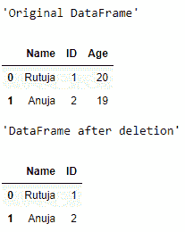
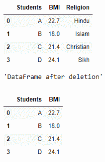

# 从熊猫数据框中删除一列

> 原文:[https://www . geesforgeks . org/delete-a-column-from-a-pandas-data frame/](https://www.geeksforgeeks.org/delete-a-column-from-a-pandas-dataframe/)

删除是数据分析的主要操作之一。我们经常看到，在进行特定分析时，数据框中的某个特定属性对我们一点用都没有，相反，拥有它可能会导致预测中出现问题和不必要的变化。例如，如果我们要分析特定学校的学生的身体质量指数，那么不需要为学生设置宗教栏/属性，所以我们更喜欢删除该栏。现在让我们看看从数据帧中删除一列的语法。

**语法:**

```py
del df['column_name']

```

现在让我们看几个例子:

**Example 1:**

```py
# importing the module
import pandas as pd

# creating a DataFrame
my_df = {'Name': ['Rutuja', 'Anuja'], 
         'ID': [1, 2], 'Age': [20, 19]}
df = pd.DataFrame(my_df)
display("Original DataFrame")
display(df)

# deleting a column
del df['Age']

display("DataFrame after deletion")
display(df)
```

**输出:**

注意‘年龄’一栏已经掉了。

**例 2:**

```py
# importing the module
import pandas as pd

# creating a DataFrame
my_df = {'Students': ['A', 'B', 'C', 'D'], 
         'BMI': [22.7, 18.0, 21.4, 24.1], 
         'Religion': ['Hindu', 'Islam', 
                      'Christian', 'Sikh']}
df = pd.DataFrame(my_df)
display("Original DataFrame")
display(df)

# deleting a column
del df['Religion']

display("DataFrame after deletion")
display(df)
```

**输出:**

注意，不必要的一栏，‘宗教’已经删除成功。