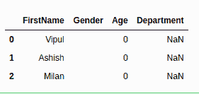
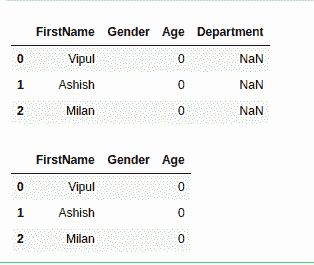
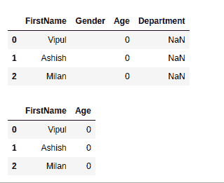
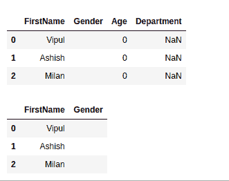
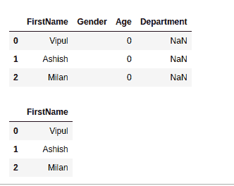

# 放下熊猫的空栏

> 原文:[https://www.geeksforgeeks.org/drop-empty-columns-in-pandas/](https://www.geeksforgeeks.org/drop-empty-columns-in-pandas/)

在本文中，我们将尝试查看删除空列、空列和零值列的不同方法。首先，我们将创建一个示例数据框，然后我们将在后续示例中执行我们的操作，到最后，您将获得如何处理熊猫这种情况的丰富知识。

**进场:**

*   导入所需的 python 库。
*   创建示例数据框。
*   使用 Pandas dropna()方法，它允许用户以不同的方式分析和删除空值的行/列。
*   显示更新的数据框。

> **语法:** DataFrameName.dropna(坐标轴=0，how='any '，inplace=False)
> 
> **参数:**
> 
> *   axis: axis 接受行/列的 int 或 string 值。整数的输入可以是 0 或 1，字符串的输入可以是“索引”或“列”。
> *   how: how 只接受两种类型的字符串值(“任意”或“全部”)。如果 any 值为空，则“ANY”删除行/列，如果 all 值为空，则“ALL”删除行/列。
> *   inplace:它是一个布尔值，如果为 True，则更改数据框本身。

**样本数据:**

这是我们将对其执行不同操作的示例数据框。

## 蟒蛇 3

```
# import required libraries
import numpy as np
import pandas as pd

# create a Dataframe
Mydataframe = pd.DataFrame({'FirstName': ['Vipul', 'Ashish', 'Milan'],
                            "Gender": ["", "", ""],
                            "Age": [0, 0, 0]})
Mydataframe['Department'] = np.nan

# show the dataframe
print(Mydataframe)
```

**输出:**



**例 1:**

删除所有空值列。

## 蟒蛇 3

```
# import required libraries
import numpy as np
import pandas as pd

# create a Dataframe
Mydataframe = pd.DataFrame({'FirstName': ['Vipul', 'Ashish', 'Milan'],
                            "Gender": ["", "", ""],
                            "Age": [0, 0, 0]})

Mydataframe['Department'] = np.nan

display(Mydataframe)

Mydataframe.dropna(how='all', axis=1, inplace=True)

# show the dataframe
display(Mydataframe)
```

**输出:**



**例 2:**

用空值替换所有空值，然后用 dropna 函数删除所有空值列。

## 蟒蛇 3

```
# import required libraries
import numpy as np
import pandas as pd

# create a Dataframe
Mydataframe = pd.DataFrame({'FirstName': ['Vipul', 'Ashish', 'Milan'],
                            "Gender": ["", "", ""],
                            "Age": [0, 0, 0]})

Mydataframe['Department'] = np.nan
display(Mydataframe)

nan_value = float("NaN")
Mydataframe.replace("", nan_value, inplace=True)

Mydataframe.dropna(how='all', axis=1, inplace=True)

# show the dataframe
display(Mydataframe)
```

**输出:**



**例 3:**

将所有零替换为空值，然后使用 dropna 函数删除所有空值列。

## 蟒蛇 3

```
# import required libraries
import numpy as np
import pandas as pd

# create a Dataframe
Mydataframe = pd.DataFrame({'FirstName': ['Vipul', 'Ashish', 'Milan'],
                            "Gender": ["", "", ""],
                            "Age": [0, 0, 0]})

Mydataframe['Department'] = np.nan
display(Mydataframe)

nan_value = float("NaN")
Mydataframe.replace(0, nan_value, inplace=True)

Mydataframe.dropna(how='all', axis=1, inplace=True)

# show the dataframe
display(Mydataframe)
```

**输出:**



**例 4:**

用空值替换所有零和空位置，然后用 dropna 函数删除所有空值列。

## 蟒蛇 3

```
# import required libraries
import numpy as np
import pandas as pd

# create a Dataframe
Mydataframe = pd.DataFrame({'FirstName': ['Vipul', 'Ashish', 'Milan'],
                            "Gender": ["", "", ""],
                            "Age": [0, 0, 0]})

Mydataframe['Department'] = np.nan
display(Mydataframe)

nan_value = float("NaN")
Mydataframe.replace(0, nan_value, inplace=True)
Mydataframe.replace("", nan_value, inplace=True)

Mydataframe.dropna(how='all', axis=1, inplace=True)

# show the dataframe
display(Mydataframe)
```

**输出:**

