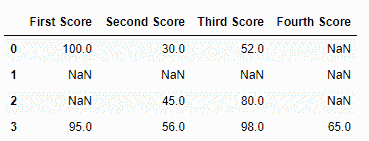

# 从熊猫数据框中删除列中缺少值或 NaN 的行

> 原文:[https://www . geesforgeks . org/drop-row-from-pandas-data frame-在列中缺少值或 nan/](https://www.geeksforgeeks.org/drop-rows-from-pandas-dataframe-with-missing-values-or-nan-in-columns/)

熊猫提供各种数据结构和操作来处理数字数据和时间序列。但是，可能会有一些数据丢失的情况。在熊猫中，缺失的数据由两个值表示:

*   **None:** None 是 Python 单例对象，常用于 Python 代码中的缺失数据。
*   **NaN:**NaN(Not a Number 的缩写)是一个特殊的浮点值，所有使用标准 IEEE 浮点表示的系统都可以识别它

熊猫认为`None`和`NaN`在表示缺失或空值时基本上可以互换。为了从数据框中删除空值，我们使用了`[dropna()](https://www.geeksforgeeks.org/python-pandas-dataframe-dropna/)`函数该函数以不同的方式删除具有空值的数据集的行/列。

> **语法:**
> DataFrame.dropna(axis=0，how='any '，thresh=None，subset=None，inplace=False)
> 
> **参数:**
> **轴:**轴取行/列的 int 或 string 值。整数的输入可以是 0 或 1，字符串的输入可以是“索引”或“列”。
> **how:** how 只取两种类型的字符串值(' any '或' all ')。如果 any 值为空，则“ANY”删除行/列，如果 all 值为空，则“ALL”删除行/列。
> **thresh:** thresh 取整数值，表示 na 值下降的最小值。
> **子集:**它是一个数组，将删除过程限制为通过列表传递行/列。
> **inplace:** 是一个布尔值，如果为 True，则改变数据框本身。

**代码#1:** 删除至少有 1 个空值的行。

```
# importing pandas as pd
import pandas as pd

# importing numpy as np
import numpy as np

# dictionary of lists
dict = {'First Score':[100, 90, np.nan, 95],
        'Second Score': [30, np.nan, 45, 56],
        'Third Score':[52, 40, 80, 98],
        'Fourth Score':[np.nan, np.nan, np.nan, 65]}

# creating a dataframe from dictionary
df = pd.DataFrame(dict)

df
```


现在我们删除至少有一个 Nan 值(空值)的行

```
# importing pandas as pd
import pandas as pd

# importing numpy as np
import numpy as np

# dictionary of lists
dict = {'First Score':[100, 90, np.nan, 95],
        'Second Score': [30, np.nan, 45, 56],
        'Third Score':[52, 40, 80, 98],
        'Fourth Score':[np.nan, np.nan, np.nan, 65]}

# creating a dataframe from dictionary
df = pd.DataFrame(dict)

# using dropna() function  
df.dropna()
```

**输出:**

**代码#2:** 如果该行中的所有值都丢失，则丢弃该行。

```
# importing pandas as pd
import pandas as pd

# importing numpy as np
import numpy as np

# dictionary of lists
dict = {'First Score':[100, np.nan, np.nan, 95],
        'Second Score': [30, np.nan, 45, 56],
        'Third Score':[52, np.nan, 80, 98],
        'Fourth Score':[np.nan, np.nan, np.nan, 65]}

# creating a dataframe from dictionary
df = pd.DataFrame(dict)

df
```


现在我们删除所有数据缺失或包含空值(NaN)的行

```
# importing pandas as pd
import pandas as pd

# importing numpy as np
import numpy as np

# dictionary of lists
dict = {'First Score':[100, np.nan, np.nan, 95],
        'Second Score': [30, np.nan, 45, 56],
        'Third Score':[52, np.nan, 80, 98],
        'Fourth Score':[np.nan, np.nan, np.nan, 65]}

df = pd.DataFrame(dict)

# using dropna() function    
df.dropna(how = 'all')
```

**输出:**


**代码#3:** 删除至少有 1 个空值的列。

```
# importing pandas as pd
import pandas as pd

# importing numpy as np
import numpy as np

# dictionary of lists
dict = {'First Score':[100, np.nan, np.nan, 95],
        'Second Score': [30, np.nan, 45, 56],
        'Third Score':[52, np.nan, 80, 98],
        'Fourth Score':[60, 67, 68, 65]}

# creating a dataframe from dictionary 
df = pd.DataFrame(dict)

df
```


现在我们删除至少有 1 个缺失值的列

```
# importing pandas as pd
import pandas as pd

# importing numpy as np
import numpy as np

# dictionary of lists
dict = {'First Score':[100, np.nan, np.nan, 95],
        'Second Score': [30, np.nan, 45, 56],
        'Third Score':[52, np.nan, 80, 98],
        'Fourth Score':[60, 67, 68, 65]}

# creating a dataframe from dictionary  
df = pd.DataFrame(dict)

# using dropna() function     
df.dropna(axis = 1)
```

**输出:**


**代码#4:** 删除 CSV 文件中至少有 1 个空值的行。

**注意:**这里我们使用的是 CSV 文件，要下载使用的 CSV 文件，点击[这里](https://media.geeksforgeeks.org/wp-content/uploads/employees.csv)。

```
# importing pandas module 
import pandas as pd 

# making data frame from csv file 
data = pd.read_csv("employees.csv") 

# making new data frame with dropped NA values 
new_data = data.dropna(axis = 0, how ='any') 

new_data
```

**输出:**

现在我们比较数据帧的大小，这样我们就可以知道有多少行至少有 1 个空值

```
print("Old data frame length:", len(data))
print("New data frame length:", len(new_data)) 
print("Number of rows with at least 1 NA value: ",
      (len(data)-len(new_data)))
```

**输出:**

```
Old data frame length: 1000
New data frame length: 764
Number of rows with at least 1 NA value:  236

```

由于差异是 236，所以有 236 行在任何列中都至少有 1 个空值。