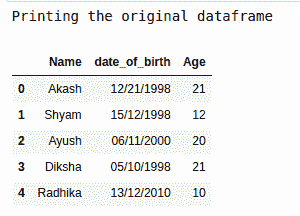
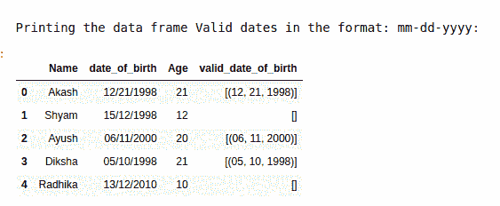

# 使用正则表达式

从给定熊猫数据帧的指定列中提取日期

> 原文:[https://www . geesforgeks . org/extract-date-from-a-specified-column-of-a-pandas-data frame-use-regex/](https://www.geeksforgeeks.org/extract-date-from-a-specified-column-of-a-given-pandas-dataframe-using-regex/)

在本文中，我们将讨论如何从给定数据框的指定列中仅提取有效日期。从指定列中提取的日期应该采用“mm-dd-yyyy”的形式。

**进场:**

在本文中，我们使用了一个正则表达式从数据框的指定列中提取有效日期。这里我们使用了\ b(1[0-2]| 0[1-9])/(3[01]|[12][0-9]| 0[1-9])/([0-9]{ 4 })\ b 这个正则表达式。我们将为此使用 re.findall()方法。现在让我们尝试使用 Python 来实现这一点:

**步骤 1:** 创建数据帧

## 蟒蛇 3

```
# importing pandas and re library
import pandas as pd
import re as re

# creating data frame with column
# name,date_of_birth and age
df = pd.DataFrame({'Name': ['Akash', 'Shyam', 'Ayush',
                            'Diksha', 'Radhika'],

                   'date_of_birth': ['12/21/1998', '15/12/1998',
                                     '06/11/2000', '05/10/1998',
                                     '13/12/2010'],

                   'Age': [21, 12, 20, 21, 10]})

# printing the original data frame
print("Printing the original dataframe")
df
```

**输出:**



**第二步:**从数据帧中提取有效日期，格式为‘mm-DD-yyyy’

## 蟒蛇 3

```
# creating function to find whether the 
# given date is valid or not
def checking_valid_dates(dt):

    # creating regular expression to check 
    # whether date fall in the format 
    # mm-dd-yyyy
    result = re.findall(
        r'\b(1[0-2]|0[1-9])/(3[01]|[12][0-9]|0[1-9])/([0-9]{4})\b', dt)
    return result

# creating new column with valid_date_of_birth
df['valid_date_of_birth'] = df['date_of_birth'].apply(
    lambda dt: checking_valid_dates(dt))

print("\nPrinting the data frame Valid dates in the format: mm-dd-yyyy:")
df
```

**输出:**

