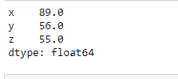
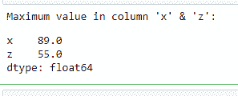
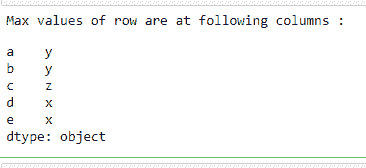

# 在熊猫的数据框的列和行中找到最大值&位置

> 原文:[https://www . geesforgeks . org/find-最大值-熊猫数据框的列和行位置/](https://www.geeksforgeeks.org/find-maximum-values-position-in-columns-and-rows-of-a-dataframe-in-pandas/)

在本文中，我们将讨论如何在 Dataframe 的列和行中找到最大值及其索引位置。

**DataFrame.max()**

Pandas **dataframe.max()** 方法查找对象中的最大值并返回。如果输入是一个序列，该方法将返回一个标量，该标量将是该序列中值的最大值。如果输入是数据帧，则该方法将返回数据帧中指定轴上最大值的系列。索引轴是此方法采用的默认轴。

> **语法:**data frame . max(axis =无，skipna =无，level =无，numeric _ only =无，**kwargs)
> **参数:**
> **axis :** {index (0)，columns (1)}
> **skipna :** 计算结果时排除 NA/null 值
> **level :** 如果 axis 为 MultiIndex(分层)，则沿特定级别计数，折叠为 Series【T0 如果没有，将尝试使用所有内容，然后只使用数字数据。不适用于系列。
> **返回:**最大值:系列或数据帧(如果指定了级别)

让我们举一个如何使用这个函数的例子。假设我们有一个数据框架

## 蟒蛇 3

```
import numpy as np
import pandas as pd
# List of Tuples
matrix = [(10, 56, 17),
          (np.NaN, 23, 11),
          (49, 36, 55),
          (75, np.NaN, 34),
          (89, 21, 44)
          ]
# Create a DataFrame
abc = pd.DataFrame(matrix, index = list('abcde'), columns = list('xyz'))

# output
abc
```

**输出:**


**如何求每一列的最大值？**

若要查找每列的最大值，请在不使用任何参数的情况下调用 Dataframe 对象上的 max()方法。

## 蟒蛇 3

```
# find the maximum of each column
maxValues = abc.max()

print(maxValues)
```

**输出:**



我们可以看到它返回了一系列最大值，其中索引是列名，值是每列的最大值。

**如何求每行的最大值？**

若要查找每行的最大值，请在参数轴= 1 的 Dataframe 对象上调用 max()方法。

## 蟒蛇 3

```
# find the maximum values of each row
maxValues = abc.max(axis = 1)
print(maxValues)
```

**输出:**


我们可以看到它返回了一系列最大值，其中索引是行名，值是每行的最大值。我们可以看到，在上面的例子中，在寻找任何轴的最大值时都会跳过 NaN 值。如果我们愿意，也可以包含 NaN 值。

**如何在不跳过 NaN 的情况下找到每一列的最大值？**

## 蟒蛇 3

```
# find maximum value of each
# column without skipping NaN
maxValues = abc.max(skipna = False)

print(maxValues)
```

**输出:**


通过将 skipna=False，我们还可以包括 NaN 值。如果存在任何 NaN 值，它将被视为最大值。

**如何求单列或选定列的最大值？**

要获取单个列的最大值，请参见以下示例

## 蟒蛇 3

```
# find maximum value of a
# single column 'x'
maxClm = df['x'].max()

print("Maximum value in column 'x': " )
print(maxClm)
```

**输出:**


我们有另一种方法可以找到列的最大值:

## 蟒蛇 3

```
# find maximum value of a
# single column 'x'
maxClm = df.max()['x']
```

结果会和上面一样。
**输出:**


也可以传递列列表而不是单个列来查找指定列的最大值

## 蟒蛇 3

```
# find maximum values of a list of columns
maxValues = df[['x', 'z']].max()

print("Maximum value in column 'x' & 'z': ")
print(maxValues)
```

**输出:**



**如何获取各列最大值的位置？**

**data frame . idxmax():**Pandas**data frame . idxmax()**方法返回请求轴上最大值首次出现的索引。当在任何索引中查找最大值的索引时，所有 NA/null 值都被排除在外。

> 语法:DataFrame.idxmax(轴=0，skipna=True)
> 参数:
> 轴:行为 0 或“索引”，列为 1 或“列”
> skipna:排除 NA/null 值。如果整行/整列为 NA，结果将为 NA
> 返回:idxmax:系列

让我们举一些例子来了解如何使用它:

**如何获取每列最大值的行索引标签**

## 蟒蛇 3

```
# find the index position of maximum
# values in every column
maxValueIndex = df.idxmax()

print("Maximum values of columns are at row index position :")
print(maxValueIndex)
```

**输出:**


它返回一个包含列名作为索引和行名作为索引标签的序列，其中该列中存在最大值。

**如何找到每行最大值的列名？**

## 蟒蛇 3

```
# find the column name of maximum
# values in every row
maxValueIndex = df.idxmax(axis = 1)

print("Max values of row are at following columns :")
print(maxValueIndex)
```

**输出:**



它返回一个系列，其中包含作为索引的行索引标签和作为值的列名，其中最大值存在于该行中。