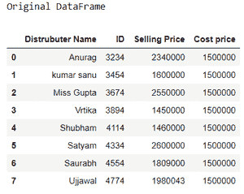
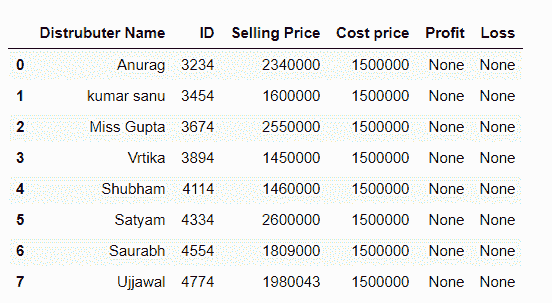
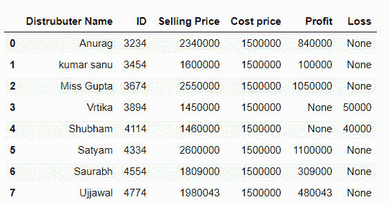

# 用熊猫

在给定的 Excel 表格中找出损益

> 原文:[https://www . geeksforgeeks . org/查找给定工作表中的损益-使用熊猫/](https://www.geeksforgeeks.org/find-the-profit-and-loss-in-the-given-excel-sheet-using-pandas/)

在这些文章中，我们将讨论如何从 Excel 文件中提取数据，并找到给定数据的损益。假设我们的 Excel 文件看起来像这样，那么我们必须从列中提取销售价格和成本价，找到损益并将其存储到一个新的数据框列中。


要获取使用的 excel 文件，请点击这里的[。](https://drive.google.com/file/d/1HNlNTcOL9XY_amMMj4PuRT5D7oeHsZmG/view?usp=sharing)

那么，让我们讨论一下方法:

**第一步:**导入所需模块，从 excel 读取数据。

## 蟒蛇 3

```
# importing module

import pandas as pd;

# Creating df
# Reading data from Excel
data = pd.read_excel("excel_work/book_sample.xlsx");

print("Original DataFrame")
data
```

**输出:**



**步骤 2:** 在数据框中为商店损益创建一个新列

## 蟒蛇 3

```
# Create column for profit and loss
data['Profit']= None
data['Loss']= None

data
```

**输出:**



**第 3 步:**为访问数据框列设置销售价格、成本价、利润和亏损指数

## 蟒蛇 3

```
# set index
index_selling = data.columns.get_loc('Selling Price')
index_cost = data.columns.get_loc('Cost price')
index_profit = data.columns.get_loc('Profit')
index_loss = data.columns.get_loc('Loss')

print(index_selling, index_cost, index_profit, index_loss)
```

**输出:**

```
2 3 4 5

```

**第四步:**根据各列指标计算损益。

```
Profit = Selling price - Cost price
Loss = Cost price - Selling price
```

## 蟒蛇 3

```
# Loop for accessing every index in DataFrame
# and compute Profit and loss
# and store into new column in DataFrame
for row in range(0, len(data)):
    if data.iat[row, index_selling] > data.iat[row, index_cost]:
        data.iat[row, index_profit] = data.iat[row,
                                               index_selling] - data.iat[row, index_cost]
    else:
        data.iat[row, index_loss] = data.iat[row,
                                             index_cost]-data.iat[row, index_selling]
data
```

**输出:**

