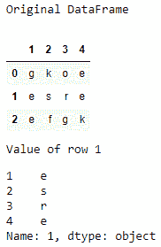
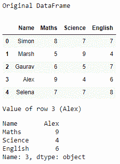

# 获取给定熊猫数据框中的特定行

> 原文:[https://www . geeksforgeeks . org/get-特定行-给定熊猫-dataframe/](https://www.geeksforgeeks.org/get-a-specific-row-in-a-given-pandas-dataframe/)

在熊猫数据框中，我们可以使用函数 [**iloc()**](https://www.geeksforgeeks.org/python-extracting-rows-using-pandas-iloc/) 找到指定的行值。在这个函数中，我们传递行号作为参数。

## 熊猫。DataFrame.iloc[]

> **语法:**熊猫。
> **参数:**
> 
> *   **索引位置:**整数或整数列表中行的索引位置。
> 
> **返回类型:**数据帧或序列，取决于参数

**例 1 :**

```py
# importing the module
import pandas as pd

# creating a DataFrame
data = {'1' : ['g', 'e', 'e'], 
        '2' : ['k', 's', 'f'], 
        '3' : ['o', 'r', 'g'], 
        '4' : ['e', 'e', 'k']}
df = pd.DataFrame(data)
print("Original DataFrame")
display(df)

print("Value of row 1")
display(df.iloc[1])
```

**输出:**



**例 2:**

```py
# importing the module
import pandas as pd

# creating a DataFrame
data = {'Name' : ['Simon', 'Marsh', 'Gaurav', 
                 'Alex', 'Selena'],  
        'Maths' : [8, 5, 6, 9, 7],  
        'Science' : [7, 9, 5, 4, 7], 
        'English' : [7, 4, 7, 6, 8]} 
df = pd.DataFrame(data)
print("Original DataFrame")
display(df)

print("Value of row 3 (Alex)")
display(df.iloc[3])
```

**输出:**

