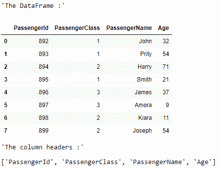
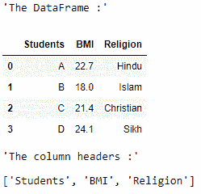

# 从熊猫数据框中获取列标题列表

> 原文:[https://www . geesforgeks . org/get-list-of-column-header-from-a-pandas-data frame/](https://www.geeksforgeeks.org/get-list-of-column-headers-from-a-pandas-dataframe/)

让我们看看如何将熊猫数据框的所有列标题作为一个列表。`df.columns.values`属性将返回一个列标题列表。

**例 1 :**

```py
# importing pandas as pd
import pandas as pd

# creating the dataframe
df = pd.DataFrame({'PassengerId': [892, 893, 894, 895, 
                                   896, 897, 898, 899],
                   'PassengerClass': [1, 1, 2, 1, 3, 3, 2, 2],
                   'PassengerName': ['John', 'Prity', 'Harry', 
                                     'Smith', 'James', 'Amora', 
                                     'Kiara', 'Joseph'], 
                   'Age': [32, 54, 71, 21, 37, 9, 11, 54]})

display("The DataFrame :")
display(df)

# print the list of all the column headers
display("The column headers :")
display(list(df.columns.values))
```

**输出:**


**例 2 :**

```py
# importing pandas as pd
import pandas as pd

# creating the dataframe
my_df = {'Students': ['A', 'B', 'C', 'D'], 
         'BMI': [22.7, 18.0, 21.4, 24.1], 
         'Religion': ['Hindu', 'Islam', 
                      'Christian', 'Sikh']}
df = pd.DataFrame(my_df)
display("The DataFrame :")
display(df)

# print the list of all the column headers
display("The column headers :")
display(list(df.columns.values))
```

**输出:**
