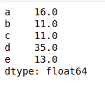
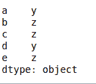

# 获取行或列中的最小值及其在 Pandas-Dataframe 中的索引位置

> 原文:[https://www . geeksforgeeks . org/get-最小行或列值及其索引-熊猫位置-dataframe/](https://www.geeksforgeeks.org/get-minimum-values-in-rows-or-columns-with-their-index-position-in-pandas-dataframe/)

让我们讨论如何在数据框的行和列中找到最小值以及它们的索引位置。

**a)求行和列中的最小值:**

[Dataframe.min()](https://www.geeksforgeeks.org/python-pandas-dataframe-min/) :此函数返回给定对象中的最小值。如果输入是一个序列，该方法将返回一个标量，该标量将是该序列中值的最小值。如果输入是数据帧，则该方法将返回数据帧中指定轴上值最少的系列。默认情况下，该轴是索引轴。

**1)获取每一列的最小值:**
使用`min()`函数找到索引轴上的最小值。

**代码:**

```
# import pandas library
import pandas as pd

# list of Tuples
data = [
          (20, 16, 23),
          (30, None, 11),
          (40, 34, 11),
          (50, 35, None),
          (60, 40, 13)
        ]

# creating a DataFrame object
df = pd.DataFrame(data, index = ['a', 'b', 'c', 'd', 'e'],
                     columns = ['x', 'y', 'z'])

# getting a series object containing 
# minimum value from each column
# of given dataframe
minvalue_series = df.min()

minvalue_series
```

**输出:**


**2)获取每一行的最小值:**
在具有“轴= 1”属性的数据框上使用`min()`函数来查找行轴上的最小值。

**代码:**

```
# import pandas library
import pandas as pd

# list of Tuples
data = [
          (20, 16, 23),
          (30, None, 11),
          (40, 34, 11),
          (50, 35, None),
          (60, 40, 13)
        ]

# creating a DataFrame object
df = pd.DataFrame(data, index = ['a', 'b', 'c', 'd', 'e'],
                     columns = ['x', 'y', 'z'])

# getting a series object containing 
# minimum value from each row
# of given dataframe
minvalue_series = df.min(axis = 1)

minvalue_series
```

**输出:**



**3)获取每一列的最小值，不跳过无值:**
在数据帧上使用`min()`函数，该数据帧具有带“skipna = False”属性的 n a 值，以查找列轴上的最小值。

**代码:**

```
# import pandas library
import pandas as pd

# list of Tuples
data = [
          (20, 16, 23),
          (30, None, 11),
          (40, 34, 11),
          (50, 35, None),
          (60, 40, 13)
        ]

# creating a DataFrame object
df = pd.DataFrame(data, index = ['a', 'b', 'c', 'd', 'e'],
                     columns = ['x', 'y', 'z'])

# getting a series object containing 
# minimum value from each column
# of given dataframe without
# skipping None value
minvalue_series = df.min(skipna = False)

minvalue_series
```

**输出:**


**4)获取单个列的最小值:**
对一个数列使用`min()`函数，求数列中的最小值。

**代码:**

```
# import pandas library
import pandas as pd

# list of Tuples
data = [
          (20, 16, 23),
          (30, None, 11),
          (40, 34, 11),
          (50, 35, None),
          (60, 40, 13)
        ]

# creating a DataFrame object
df = pd.DataFrame(data, index = ['a', 'b', 'c', 'd', 'e'],
                     columns = ['x', 'y', 'z'])

# getting a minimum value
# from column 'x'
minvalue = df['x'].min()

minvalue
```

**输出:**

```
20
```

**b)获取行索引标签或行与列间最小值的位置:**

[Dataframe.idxmin()](https://www.geeksforgeeks.org/python-pandas-dataframe-idxmin/) :此函数返回请求轴上最小值的第一次出现的索引。当在任何索引中寻找最小值的索引时，所有的 NA/null 值都被排除。

**1)获取每列最小值的行索引标签:**
使用`idxmin()`功能，沿索引轴查找最小值的索引/标签。

**代码:**

```
# import pandas library
import pandas as pd

# list of Tuples
data = [
          (20, 16, 23),
          (30, None, 11),
          (40, 34, 11),
          (50, 35, None),
          (60, 40, 13)
        ]

# creating a DataFrame object
df = pd.DataFrame(data, index = ['a', 'b', 'c', 'd', 'e'],
                     columns = ['x', 'y', 'z'])

# get the index position\label of
# minimum values in every column
minvalueIndexLabel = df.idxmin()

minvalueIndexLabel
```

**输出**


**2)获取每行最小值的列名:**
使用带有‘轴= 1’属性的`idxmin()`函数，沿列轴查找最小值的索引/标签。

**代码:**

```
# import pandas library
import pandas as pd

# list of Tuples
data = [
          (20, 16, 23),
          (30, None, 11),
          (40, 34, 11),
          (50, 35, None),
          (60, 40, 13)
        ]

# creating a DataFrame object
df = pd.DataFrame(data, index = ['a', 'b', 'c', 'd', 'e'],
                     columns = ['x', 'y', 'z'])

# get the index position\label of
# minimum values in every row
minvalueIndexLabel = df.idxmin(axis = 1)

minvalueIndexLabel
```

**输出**

