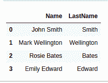

# 获取 Pandas-Python 中该列的子串

> 原文:[https://www . geesforgeks . org/get-the-substring-of-the-column-in-pandas-python/](https://www.geeksforgeeks.org/get-the-substring-of-the-column-in-pandas-python/)

现在，我们将看到如何获取熊猫数据帧中一列的所有值的子字符串。这种提取在处理数据时非常有用。例如，我们在一个列中有不同人的名字和姓氏，我们需要提取他们名字的前 3 个字母来创建他们的用户名。

**示例 1:**
我们可以遍历列的范围，计算列中每个值的子串。

```py
# importing pandas as pd
import pandas as pd 

# creating a dictionary
dict = {'Name':["John Smith", "Mark Wellington", 
                "Rosie Bates", "Emily Edward"]}

# converting the dictionary to a
# dataframe
df = pd.DataFrame.from_dict(dict)

# storing first 3 letters of name
for i in range(0, len(df)):
    df.iloc[i].Name = df.iloc[i].Name[:3]

df
```

**输出:**


**注意:**更多信息请参考 [Python 使用熊猫提取行](https://www.geeksforgeeks.org/python-extracting-rows-using-pandas-iloc/)

**示例 2:** 在本例中，我们将使用`[str.slice()](https://www.geeksforgeeks.org/python-pandas-series-str-slice/)`。

```py
# importing pandas as pd
import pandas as pd 

# creating a dictionary
dict = {'Name':["John Smith", "Mark Wellington",
                "Rosie Bates", "Emily Edward"]}

# converting the dictionary to a 
# dataframe
df = pd.DataFrame.from_dict(dict)

# storing first 3 letters of name as username
df['UserName'] = df['Name'].str.slice(0, 3)

df
```

**输出:**


**示例 3:** 我们也可以通过使用方括号以不同的方式使用 str 访问器。

```py
# importing pandas as pd
import pandas as pd 

# creating a dictionary
dict = {'Name':["John Smith", "Mark Wellington", 
                "Rosie Bates", "Emily Edward"]}

# converting the dictionary to a dataframe
df = pd.DataFrame.from_dict(dict)

# storing first 3 letters of name as username
df['UserName'] = df['Name'].str[:3]

df
```

**输出:**


**例 4:** 我们也可以使用 **[str.extract](https://www.geeksforgeeks.org/python-pandas-series-str-extract/)** 来完成这个任务。在本例中，我们将在“姓氏”列中存储每个人的姓氏。

```py
# importing pandas as pd
import pandas as pd 

# creating a dictionary
dict = {'Name':["John Smith", "Mark Wellington",
                "Rosie Bates", "Emily Edward"]}

# converting the dictionary to a dataframe
df = pd.DataFrame.from_dict(dict)

# storing lastname of each person
df['LastName'] = df.Name.str.extract(r'\b(\w+){content}apos;, 
                                     expand = True)

df
```

**输出:**

