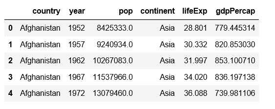

# 从熊猫数据框的一列中获取唯一值

> 原文:[https://www . geesforgeks . org/get-unique-values-from-in-column-pandas-data frame/](https://www.geeksforgeeks.org/getting-unique-values-from-a-column-in-pandas-dataframe/)

让我们看看如何从熊猫数据框中检索唯一的值。

让我们从 CSV 文件创建一个数据帧。我们正在使用不同国家过去的国内生产总值数据。可以从[这里](https://raw.githubusercontent.com/resbaz/r-novice-gapminder-files/master/data/gapminder-FiveYearData.csv)获取数据集。

```
# import pandas as pd
import pandas as pd

gapminder_csv_url ='http://bit.ly/2cLzoxH'
# load the data with pd.read_csv
record = pd.read_csv(gapminder_csv_url)

record.head()
```



**方法#1:** 从记录中选择*大陆*列，应用唯一函数得到我们想要的值。

```
# import pandas as pd
import pandas as pd

gapminder_csv_url ='http://bit.ly/2cLzoxH'
# load the data with pd.read_csv
record = pd.read_csv(gapminder_csv_url)

print(record['continent'].unique())
```

**输出:**

```
['Asia' 'Europe' 'Africa' 'Americas' 'Oceania']

```

**方法 2:** 从*国家*栏中选择唯一值。

```
# import pandas as pd
import pandas as pd

gapminder_csv_url ='http://bit.ly/2cLzoxH'

# load the data with pd.read_csv
record = pd.read_csv(gapminder_csv_url)

print(record.country.unique())
```

**输出:**

```
['Afghanistan' 'Albania' 'Algeria' 'Angola' 'Argentina' 'Australia'
 'Austria' 'Bahrain' 'Bangladesh' 'Belgium' 'Benin' 'Bolivia'
 'Bosnia and Herzegovina' 'Botswana' 'Brazil' 'Bulgaria' 'Burkina Faso'
 'Burundi' 'Cambodia' 'Cameroon' 'Canada' 'Central African Republic'
 'Chad' 'Chile' 'China' 'Colombia' 'Comoros' 'Congo Dem. Rep.'
 'Congo Rep.' 'Costa Rica' "Cote d'Ivoire" 'Croatia' 'Cuba'
 'Czech Republic' 'Denmark' 'Djibouti' 'Dominican Republic' 'Ecuador'
 'Egypt' 'El Salvador' 'Equatorial Guinea' 'Eritrea' 'Ethiopia' 'Finland'
 'France' 'Gabon' 'Gambia' 'Germany' 'Ghana' 'Greece' 'Guatemala' 'Guinea'
 'Guinea-Bissau' 'Haiti' 'Honduras' 'Hong Kong China' 'Hungary' 'Iceland'
 'India' 'Indonesia' 'Iran' 'Iraq' 'Ireland' 'Israel' 'Italy' 'Jamaica'
 'Japan' 'Jordan' 'Kenya' 'Korea Dem. Rep.' 'Korea Rep.' 'Kuwait'
 'Lebanon' 'Lesotho' 'Liberia' 'Libya' 'Madagascar' 'Malawi' 'Malaysia'
 'Mali' 'Mauritania' 'Mauritius' 'Mexico' 'Mongolia' 'Montenegro'
 'Morocco' 'Mozambique' 'Myanmar' 'Namibia' 'Nepal' 'Netherlands'
 'New Zealand' 'Nicaragua' 'Niger' 'Nigeria' 'Norway' 'Oman' 'Pakistan'
 'Panama' 'Paraguay' 'Peru' 'Philippines' 'Poland' 'Portugal'
 'Puerto Rico' 'Reunion' 'Romania' 'Rwanda' 'Sao Tome and Principe'
 'Saudi Arabia' 'Senegal' 'Serbia' 'Sierra Leone' 'Singapore'
 'Slovak Republic' 'Slovenia' 'Somalia' 'South Africa' 'Spain' 'Sri Lanka'
 'Sudan' 'Swaziland' 'Sweden' 'Switzerland' 'Syria' 'Taiwan' 'Tanzania'
 'Thailand' 'Togo' 'Trinidad and Tobago' 'Tunisia' 'Turkey' 'Uganda'
 'United Kingdom' 'United States' 'Uruguay' 'Venezuela' 'Vietnam'
 'West Bank and Gaza' 'Yemen Rep.' 'Zambia' 'Zimbabwe']

```

**方法#3:**

在这个方法中，您可以看到我们使用唯一函数中的 dataframe 作为参数，尽管我们选择了与上面相同的列，因此我们得到了相同的输出。

```
# Write Python3 code here
# import pandas as pd
import pandas as pd

gapminder_csv_url ='http://bit.ly/2cLzoxH'

# load the data with pd.read_csv
record = pd.read_csv(gapminder_csv_url)

print(pd.unique(record['continent']))
```

**输出:**

```
['Asia' 'Europe' 'Africa' 'Americas' 'Oceania']

```