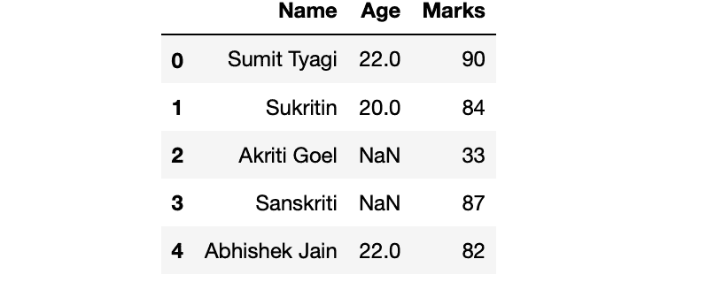
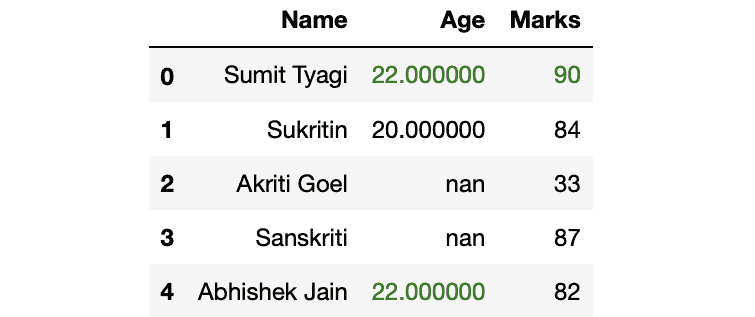

# 突出熊猫 Python 中最后两列的最大值

> 原文:[https://www . geesforgeks . org/highlight-最大值-最后两列-in-pandas-python/](https://www.geeksforgeeks.org/highlight-the-maximum-value-in-last-two-columns-in-pandas-python/)

在本文中，我们将讨论如何突出熊猫数据框中的最大值。让我们首先制作一个数据框:
**示例:**

## 蟒蛇 3

```
# Import Required Libraries
import pandas as pd
import numpy as np

# Create a dictionary for the dataframe
dict = {'Name': ['Sumit Tyagi', 'Sukritin', 'Akriti Goel',
                 'Sanskriti', 'Abhishek Jain'],
        'Age': [22, 20, np.nan, np.nan, 22],
        'Marks': [90, 84, 33, 87, 82]}

# Converting Dictionary to Pandas Dataframe
df = pd.DataFrame(dict)

# Print Dataframe
df
```

**输出:**



现在，进入重点部分。我们的目标是突出显示最后 2 列中具有最大值的单元格。

#### 方法 1:突出显示最后两列中具有最大值的单元格

我们将通过使用 DataFrame 属性的 highlight_max()方法来实现这一点。highlight_max()方法接受 3 个参数，

*   **子集:**要查找其最大值的列的名称
*   **颜色:**要突出显示单元格的颜色的名称
*   **轴:** (0/1)基于哪个轴你想找到最大值。

**示例:**

## 蟒蛇 3

```
# Highlighting the maximum values 
# of last 2 columns
df.style.highlight_max(subset = ['Age', 'Marks'],
                       color = 'lightgreen', axis = 0)
```

**输出:**


#### 方法 2:我们不使用列名，而是将其归纳为最后两列

**示例:**

## 蟒蛇 3

```
# Highlighting the maximum values of
# last 2 columns
df.style.highlight_max(subset = df.columns[-2:],
                       color = 'lightgreen', axis = 0)
```

**输出:**


#### 方法 3:突出显示文本而不是单元格

#### 示例:

## 蟒蛇 3

```
# Defining custom function which returns
# the list for df.style.apply() method
def highlight_max(s):
    is_max = s == s.max()
    return ['color: green' if cell else '' for cell in is_max]

df.style.apply(highlight_max, subset = df.columns[-2:])
```

**输出:**



#### 方法 4:用最大值突出显示单元格

#### 示例:

## 蟒蛇 3

```
# Defining custom function which returns
# the list for df.style.apply() method
def highlight_max(s):
    is_max = s == s.max()
    return ['background: lightgreen' if cell else '' for cell in is_max]

df.style.apply(highlight_max, subset = df.columns[-2:])
```

**输出:**

