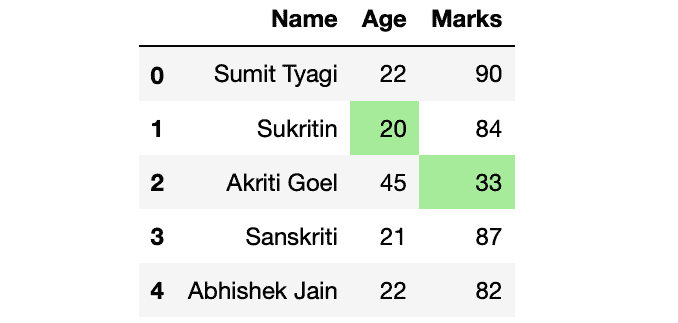
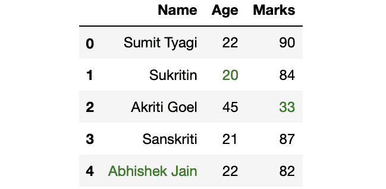
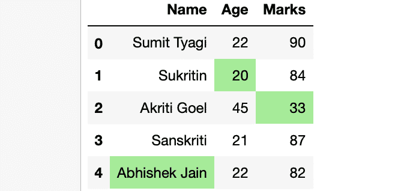
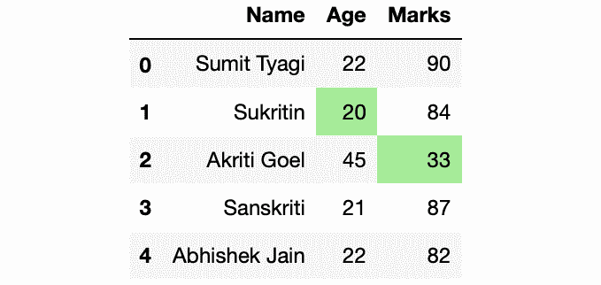

# 突出熊猫中每一列的最小值

> 原文:[https://www . geesforgeks . org/highlight-熊猫每栏最低价值/](https://www.geeksforgeeks.org/highlight-the-minimum-value-in-each-column-in-pandas/)

在本文中，我们将讨论如何突出熊猫数据框中的最小值。所以，让我们首先制作一个数据帧:

## 蟒蛇 3

```py
# Import Required Libraries
import pandas as pd
import numpy as np

# Create a dictionary for the dataframe
dict = {
  'Name': ['Sumit Tyagi', 'Sukritin', 
           'Akriti Goel', 'Sanskriti',
           'Abhishek Jain'],
  'Age': [22, 20, 45, 21, 22],
  'Marks': [90, 84, 33, 87, 82]
}

# Converting Dictionary to 
# Pandas Dataframe
df = pd.DataFrame(dict)

# Print Dataframe
print(df)
```

**输出:**


现在，进入重点部分。我们的目标是突出显示每列中具有最小值的单元格。

**方法 1:** 采用 **df.style.highlight_min()** 方法。

> **语法:**data frame . style . highlight _ min(子集，颜色，轴)
> **参数:**
> 
> *   **子集:**要求最小值的列的名称。
> *   **颜色:**要突出显示单元格的颜色的名称
> *   **轴:** {0 或‘索引’、1 或‘列’}基于您想要找到最小值的轴。
> 
> **返回:** Styler 对象。

**示例:**突出显示每列中具有最小值的单元格。

## 蟒蛇 3

```py
# Highlighting the minimum values of last 2 columns
df.style.highlight_min(color = 'lightgreen', 
                       axis = 0)
```

**输出:**



**方法 2:** 使用 **df.style.apply()** 方法。

> **语法:** DataFrame.style.apply(self，func，axis=0，subset=None，**kwargs)
> **参数:**
> 
> *   **功能:**应该带一只熊猫。系列还是熊猫。基于轴的数据框，应该返回具有相同形状的对象。
> *   **轴:** {0 或‘索引’，1 或‘列’，无}，默认 0。应用于每一列(轴=0 或“索引”)、每一行(轴=1 或“列”)，或一次应用于整个数据框，轴=无。
> *   **子集:**要调用函数的一组列或行。
> *   *** *夸脱:**传递给 func。
> 
> **返回:** Styler 对象。

**示例 1:** 突出显示文本而不是单元格。

## 蟒蛇 3

```py
# Defining custom function 
# which returns the list for
# df.style.apply() method
def highlight_min(s):

    is_min = s == s.min()

    return ['color: green' if cell else '' 
            for cell in is_min]

df.style.apply(highlight_min)
```

**输出:**



**示例 2:** 用最小值突出显示单元格。

## 蟒蛇 3

```py
# Defining custom function
# which returns the list for
# df.style.apply() method
def highlight_min(s):
    is_min = s == s.min()

    return ['background: lightgreen' if cell else '' 
            for cell in is_min]

df.style.apply(highlight_min)
```

**输出:**



**示例 3:** 突出显示具有最小值但不突出显示字符串值的单元格。

## 蟒蛇 3

```py
# Defining custom function 
# which returns the list for
# df.style.apply() method
def highlight_min(s):
    if s.dtype == np.object:
        is_min = [False for _ in range(s.shape[0])]
    else:
        is_min = s == s.min()

    return ['background: lightgreen' if cell else '' 
            for cell in is_min]

df.style.apply(highlight_min)
```

**输出:**

