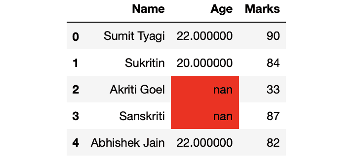

# 突出熊猫数据框中的 nan 值

> 原文:[https://www . geesforgeks . org/highlight-the-nan-values-in-pandas-data frame/](https://www.geeksforgeeks.org/highlight-the-nan-values-in-pandas-dataframe/)

在本文中，我们将讨论如何突出熊猫数据框中的 NaN(不是数字)值。NaN 值用于表示空值，有时它是数学溢出的结果。
首先制作一个数据帧:

## 蟒蛇 3

```py
# Import Required Libraries
import pandas as pd
import numpy as np

# Create a dictionary for the dataframe
dict = {'Name': ['Sumit Tyagi', 'Sukritin', 'Akriti Goel',
                 'Sanskriti', 'Abhishek Jain'],
        'Age': [22, 20, np.nan, np.nan, 22],
        'Marks': [90, 84, 33, 87, 82]}

# Converting Dictionary to Pandas Dataframe
df = pd.DataFrame(dict)

# Print Dataframe
df
```

**输出:**


现在，进入重点部分。我们的目标是突出那些具有 **Nan** 值的细胞。

**方法 1:** 用 nan 值突出显示单元格

我们可以通过使用 DataFrame.style 属性的 highlight_null()方法来实现这一点。这是一个返回 Styler 对象的属性，该对象具有格式化和显示数据帧的有用方法。highlight_null()方法需要一个字符串参数(要突出显示单元格的颜色名称)。

**示例:**

## 蟒蛇 3

```py
# Highlighting cell with nan values
df.style.highlight_null('red')
```

**输出:**



**方法 2:** 用 nan 值而不是背景突出显示文本

我们可以通过使用 style 属性的 [applymap()](https://www.geeksforgeeks.org/python-pandas-dataframe-applymap/) 方法来实现。applymap()方法需要一个接受标量并返回标量的函数。
T3】例:

## 蟒蛇 3

```py
# Highlighting text instead of the 
# cell's background
df.style.applymap(lambda cell: 'color:red' if pd.isnull(cell) else '')
```

**输出:**


**方法 3:** 用 nan 值突出显示完整行的文本

我们可以使用 [apply()](https://www.geeksforgeeks.org/python-pandas-apply/) 方法
**示例:**

## 蟒蛇 3

```py
# Highlighting text of the complete row
df.style.apply(lambda row: np.repeat('color: red' if row.isnull().any() else '',
                                     row.shape[0]), axis=1)
```