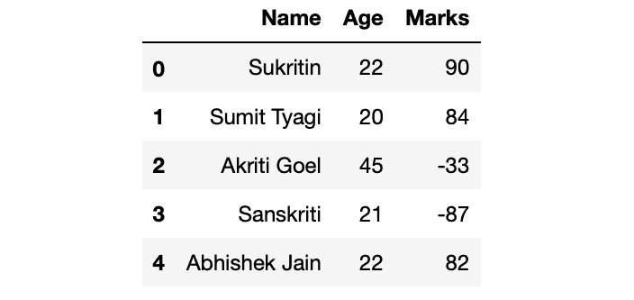

# 突出熊猫数据框中的负值红色和正值黑色

> 原文:[https://www . geesforgeks . org/highlight-负值-红色-正值-熊猫中的黑色-dataframe/](https://www.geeksforgeeks.org/highlight-the-negative-values-red-and-positive-values-black-in-pandas-dataframe/)

让我们看看[熊猫数据框](https://www.geeksforgeeks.org/python-pandas-dataframe/)中突出正值红色和负值黑色的各种方法。
首先，让我们制作一个数据框架:

## 蟒蛇 3

```py
# Import Required Libraries
import pandas as pd
import numpy as np

# Create a dictionary for the dataframe
dict = {
  'Name': ['Sukritin', 'Sumit Tyagi', 
           'Akriti Goel', 'Sanskriti',
           'Abhishek Jain'],
   'Age': [22, 20, 45, 21, 22],
  'Marks': [90, 84, -33, -87, 82]
}

# Converting Dictionary to
# Pandas Dataframe
df = pd.DataFrame(dict)

# Print Dataframe
print(df)
```

**输出:**



现在，进入重点部分。我们的目标是突出红色的负价值和黑色的正价值。

**方法 1:** 使用**数据框. style.apply()** 。

> **语法:** DataFrame.style.apply(self，func，axis=0，subset=None，**kwargs)
> **参数:**
> 
> *   **功能:**应该带一只熊猫。系列还是熊猫。基于轴的数据框，应该返回具有相同形状的对象。
> *   **轴:** {0 或‘索引’，1 或‘列’，无}，默认 0。应用于每一列(轴=0 或“索引”)、每一行(轴=1 或“列”)，或一次应用于整个数据框，轴=无。
> *   **子集:**要调用函数的一组列或行。
> *   *** *夸脱:**传递给 func。
> 
> **返回:** Styler 对象。

**示例 1:** 突出显示文本。

## 蟒蛇 3

```py
# Define a function for colouring 
# negative values red and 
# positive values black
def highlight_max(s):
    if s.dtype == np.object:
        is_neg = [False for _ in range(s.shape[0])]
    else:
        is_neg = s < 0
    return ['color: red;' if cell else 'color:black' 
            for cell in is_neg]

# Using apply method of style 
# attribute of Pandas DataFrame
df.style.apply(highlight_max)
```

**输出:**


**示例 2:** 突出显示单元格而不是文本。

## 蟒蛇 3

```py
# Define a function which 
# returns the list for 
# df.style.apply() method
def highlight_max(s):
    if s.dtype == np.object:
        is_neg = [False for _ in range(s.shape[0])]
    else:
        is_neg = s < 0
    return ['background: red; color:white' 
            if cell else 'background:black; color:white' 
            for cell in is_neg]

# Using apply method of style 
# attribute of Pandas DataFrame
df.style.apply(highlight_max)
```

**输出:**


**方法二:**采用**data frame . style . apply map()**方法。

> **语法:**data frame . style . apply map(self，func，subset=None，**kwargs)
> **参数:**
> 
> *   **函数:**取一个标量值并返回标量值
> *   **子集:**要调用函数的一组列或行。
> *   *** *夸脱:**传递给 func。
> 
> **返回:** Styler 对象。

**示例 1:** 突出显示文本。

## 蟒蛇 3

```py
# Define a function for 
# colouring negative values 
# red and positive values black
def highlight_max(cell):
    if type(cell) != str and cell < 0 :
        return 'color: red'
    else:
        return 'color: black'

df.style.applymap(highlight_max)
```

**输出:**


**示例 2:** 突出显示单元格而不是文本。

## 蟒蛇 3

```py
# Define a function which 
# returns string for 
# applymap() method
def highlight_max(cell):
    if type(cell) != str and cell < 0 :
        return 'background: red; color:black'
    else:
        return 'background: black; color: white'

df.style.applymap(highlight_max)
```

**输出:**


**注:**大熊猫。DataFrame.applymap()方法只将单个单元格传递给可调用函数，而 pandas。DataFrame.apply()传递熊猫。可调用函数的级数。

**参考:** [熊猫造型](https://pandas.pydata.org/pandas-docs/stable/user_guide/style.html)