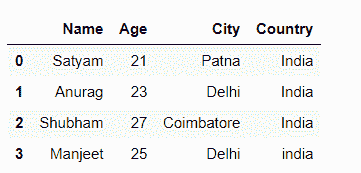

# 如何在 Python 中将列表作为一行追加到熊猫数据框中？

> 原文:[https://www . geeksforgeeks . org/如何将列表作为行追加到熊猫-python 中的数据框/](https://www.geeksforgeeks.org/how-to-append-a-list-as-a-row-to-a-pandas-dataframe-in-python/)

**先决条件:** [熊猫数据框](https://www.geeksforgeeks.org/python-pandas-dataframe/)

在本文中，我们将看到如何在 Python 中将一个列表作为一行附加到 pandas 数据框中。有三种方法可以做到:

*   使用[锁定[]](https://www.geeksforgeeks.org/python-pandas-dataframe-loc/)
*   使用 [iloc[]](https://www.geeksforgeeks.org/python-extracting-rows-using-pandas-iloc/)
*   使用[追加()](https://www.geeksforgeeks.org/python-pandas-dataframe-append/)

## 使用 loc[]方法追加列表

Pandas **DataFrame.loc** 属性通过给定数据帧中的标签或布尔数组访问一组行和列。

**让我们逐步添加列表:**

**步骤 1:** 使用列表创建一个简单的数据帧。

## 蟒蛇 3

```
import pandas as pd

# List
Person = [ ['Satyam', 21, 'Patna' , 'India' ],
            ['Anurag', 23, 'Delhi' , 'India' ],
            ['Shubham', 27, 'Coimbatore' , 'India' ]]

#Create a DataFrame object
df = pd.DataFrame(Person,
                  columns = ['Name' , 'Age', 'City' , 'Country'])

# display
display(df)
```

**输出:**


**步骤 2:** 使用 loc 将新列表追加到数据帧中。

## 蟒蛇 3

```
# New list for append into df
list = ["Saurabh", 23, "Delhi", "india"]

# using loc methods
df.loc[len(df)] = list

# display
display(df)
```

**输出:**


## 使用 iloc[]方法追加列表

熊猫 **DataFrame.iloc** 方法访问基于整数位置的索引，以便根据位置进行选择。

**示例:**

## 蟒蛇 3

```
# import module
import pandas as pd

# List
Person = [ ['Satyam', 21, 'Patna' , 'India' ],
            ['Anurag', 23, 'Delhi' , 'India' ],
            ['Shubham', 27, 'Coimbatore' , 'India' ],
            ["Saurabh", 23, "Delhi", "india"]]

#Create a DataFrame object
df = pd.DataFrame(Person,
                  columns = ['Name' , 'Age', 'City' , 'Country'])

# new list to append into df
list = ['Ujjawal', 22, 'Fathua', 'India']

# using iloc
df.iloc[2] = list

# display
display(df)
```

**输出:**


注意–它用于基于位置的索引，因此它仅适用于现有索引并替换行元素。

## 使用 Append()方法追加列表

pandas**data frame . append()**函数用于将其他数据帧的行追加到给定数据帧的末尾，返回一个新的数据帧对象。

**示例:**

## 蟒蛇 3

```
# import module
import pandas as pd

# List
Person = [ ['Satyam', 21, 'Patna' , 'India' ],
            ['Anurag', 23, 'Delhi' , 'India' ],
            ['Shubham', 27, 'Coimbatore' , 'India' ]]

#Create a DataFrame object
df = pd.DataFrame(Person,
                  columns = ['Name' , 'Age', 'City' , 'Country'])

# new list to append into df
list = [["Manjeet", 25, "Delhi", "india"]]

# using append
df = df.append(pd.DataFrame( list,
               columns=[ 'Name', 'Age', 'City', 'Country']),
               ignore_index = True)

# display df
display(df)
```

**输出:**

