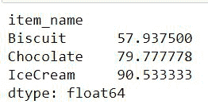

# 如何计算熊猫的加权平均值？

> 原文:[https://www . geesforgeks . org/如何计算熊猫加权平均值/](https://www.geeksforgeeks.org/how-to-calculate-weighted-average-in-pandas/)

加权平均是一种考虑数据集合中整数相对值的计算。当计算加权平均值时，在最终计算完成之前，数据集中的每个值都按预定义的权重进行缩放。

**语法:**

```
def weighted_average(dataframe, value, weight):
    val = dataframe[value]
    wt = dataframe[weight]
    return (val * wt).sum() / wt.sum()
```

它将返回该项目的加权平均值。在分子中，我们将每个值与相应的权重相乘，并将它们相加。在分母中，所有的权重相加。

### **接近**

*   我们取一个数据帧或者自己做一个数据帧。
*   用上述公式定义一个计算加权平均值的函数。
*   我们需要在数据框中至少有三个项目，即索引(可能是项目名称、日期或任何此类变量)、值和权重。
*   我们将通过传递这三个值进行函数调用。

**例**:

让我们看一个计算按项目名称分组的加权平均值的例子。

假设有三家商店，每家商店都有三种商品，即巧克力、冰淇淋和饼干。我们有所有三家商店每种商品的重量和价格。现在我们需要找出每个项目的加权平均值。

## 蟒蛇 3

```
import pandas as pd

def weighted_average(dataframe, value, weight):
    val = dataframe[value]
    wt = dataframe[weight]
    return (val * wt).sum() / wt.sum()

# creating a dataframe to represent different
# items and their corresponding weight and value
dataframe = pd.DataFrame({'item_name': ['Chocolate', 'Chocolate',
                                        'Chocolate', 'Biscuit',
                                        'Biscuit', 'Biscuit',
                                        'IceCream', 'IceCream',
                                        'IceCream'],
                          'value': [90, 50, 86, 87, 42, 48,
                                    68, 92, 102],
                          'weight': [4, 2, 3, 5, 6, 5, 3, 7,
                                     5]})

# Weighted average of value  grouped by item name
dataframe.groupby('item_name').apply(weighted_average,
                                     'value', 'weight')
```

**输出**:



## 使用 [groupby()](https://www.geeksforgeeks.org/python-pandas-dataframe-groupby/)

这里，我们将使用 groupby()函数对项目进行分组，并使用 sum 函数对这些项目进行分组来计算权重。因此，通过使用这种方法，我们只是形成一组相似的项目，以获得总和

**语法:**

```
def weighted_average_of_group(values, weights, item):
    return (values * weights).groupby(item).sum() / weights.groupby(item).sum()
```

**例**:

## 蟒蛇 3

```
import pandas as pd

def weighted_average_of_group(values, weights, item):
    return (values * weights).groupby(item).sum() / weights.groupby(item).sum()

# creating a dataframe to represent different items
# and their corresponding weight and value
dataframe = pd.DataFrame({'item_name': ['Chocolate', 'Chocolate', 'Chocolate',
                                        'Biscuit', 'Biscuit', 'Biscuit',
                                        'IceCream', 'IceCream', 'IceCream'],
                          'value': [90, 50, 86, 87, 42, 48, 68, 92, 102],
                          'weight': [4, 2, 3, 5, 6, 5, 3, 7, 5]})

# Finding grouped average of group
weighted_average_of_group(values=dataframe.value,
                          weights=dataframe.weight, item=dataframe.item_name)
```

**输出**:


为了计算整个数据帧(不是每个组，而是作为一个整体)的加权平均值，我们将使用如下所示的语法:

**语法**

```
def weighted_average_of_whole_dataframe(dataframe, value, weight):
    val = dataframe[value]
    wt = dataframe[weight]
    return (val * wt).sum() / wt.sum()
```

**例**:

## 蟒蛇 3

```
import pandas as pd

def weighted_average(dataframe, value, weight):
    val = dataframe[value]
    wt = dataframe[weight]
    return (val * wt).sum() / wt.sum()

# creating a dataframe to represent different items
# and their corresponding weight and value
dataframe = pd.DataFrame({'item_name': ['Chocolate', 'Chocolate', 'Chocolate',
                                        'Biscuit', 'Biscuit', 'Biscuit',
                                        'IceCream', 'IceCream', 'IceCream'],
                          'value': [90, 50, 86, 87, 42, 48, 68, 92, 102],
                          'weight': [4, 2, 3, 5, 6, 5, 3, 7, 5]})

# Weighted average of whole dataframe as a whole
weighted_average(dataframe, 'value', 'weight')
```

**输出:**

```
75.075
```