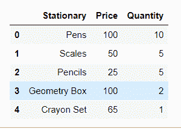
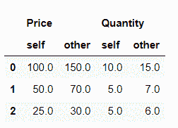
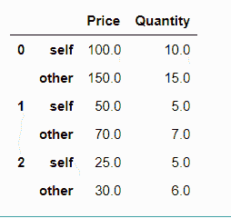
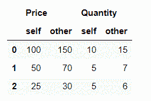
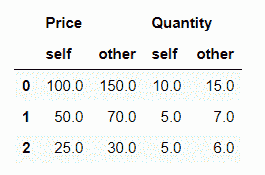

# 如何比较两个数据帧与熊猫比较？

> 原文:[https://www . geeksforgeeks . org/how-to-compare-two-data frames-with-pandas-compare/](https://www.geeksforgeeks.org/how-to-compare-two-dataframes-with-pandas-compare/)

数据框是由行和列组成的 2D 结构，数据以管状形式存储在其中。就大小和异构表格数据而言，它是可变的。算术运算也可以在行标签和列标签上执行。

了解更多熊猫数据框的创建。T3】

在这里，我们将看到如何将两个数据帧与熊猫进行比较

> **语法:**
> 
> DataFrame.compare(其他，align_axis=1，keep_shape=False，keep_equal=False)
> 
> **那么，让我们了解它的每个参数–**
> 
> 1.  **其他:**这是第一个参数，实际上是将数据帧对象与当前数据帧进行比较。
> 2.  **align_axis :** 处理要进行比较的轴(垂直/水平)(默认为 False)。 **0 或索引**:此处差异输出垂直显示， **1 或列**:差异输出水平显示。
> 3.  **keep_shape :** 表示我们是希望所有的数据值都显示在输出中，还是只显示值不同的数据值。它是 bool 类型，默认值为“false”，即默认显示表中的所有值。
> 4.  **keep_equal :** 这主要是为了设置为 True 时在输出中显示相同或相等的值。如果设置为假，那么它会将相等的值显示为 NANs。
> 
> **返回**另一个具有两个数据帧之间差异的数据帧。

在开始之前，一个重要的注意事项是熊猫版本必须至少是 1.1.0。

要进行检查，请在您的 cmd 或 Anaconda navigator cmd 上运行此程序。

```py
import pandas as pd
print(pd.__version__)

```

如果是 1.1.0 或者更大，你就可以走了！否则，您可以通过以管理员身份运行命令将 pandas 兼容版本安装到您的窗口 cmd 中，或者安装到您的 Anaconda 导航器中(如果它已添加到路径中)。

```py
# if you want the latest version available
pip install pandas --upgrade

# or if you want to specify the version
pip install pandas==1.1.0

```

**实施:**

**步骤 1:** 我们将创建第一个数据帧。

**进场:**

1.  为数据框导入熊猫
2.  为通过操作或插入出现的任何 NAN 值导入 NumPy
3.  使用熊猫创建数据帧。数据框并传递行、列的值
4.  指定列标题(根据您在字典中传递的值)

## 蟒蛇 3

```py
# pandas version == 1.1.0 (min)
import pandas as pd
import numpy as np

# create your first DataFrame
# using pd.DataFrame
first_df = pd.DataFrame(
    {
        "Stationary": ["Pens", "Scales",
                       "Pencils", "Geometry Box",
                       "Crayon Set"],
        "Price": [100, 50, 25, 100, 65],
        "Quantity": [10, 5, 5, 2, 1]
    },
    columns=["Stationary", "Price", "Quantity"],
)
# Display the df
first_df
```

**输出:**



**步骤 2:** 现在，让我们制作下一个数据框，用于比较它们的值:

## 蟒蛇 3

```py
# creating the second dataFrame by 
# copying and modifying the first DataFrame
second_df = first_df.copy()

# loc specifies the location,
# here 0th index of Price Column
second_df.loc[0, 'Price'] = 150 
second_df.loc[1, 'Price'] = 70
second_df.loc[2, 'Price'] = 30
second_df.loc[0, 'Quantity'] = 15
second_df.loc[1, 'Quantity'] = 7
second_df.loc[2, 'Quantity'] = 6

# display the df
second_df
```

**输出:**


我们正在通过复制 first_DataFrame 的表结构并进行某些修改来创建另一个 DataFrame。现在，让我们看看第二个 _DataFrame 的内容

**第三步:**我们来做主要操作——比较。

在这里，我们执行了两个操作，首先是对齐列中变化的差异，对于这两个操作，align_axis 默认设置为 1，表格将具有交替从自身和其他绘制的列。

## 蟒蛇 3

```py
#Align the differences on the columns
first_df.compare(second_df)
```

**输出:**



其次，我们设置了 align_axis = 0，这使得表格行从自己和他人中交替绘制。

## 蟒蛇 3

```py
# align the differences on rows
first_df.compare(second_df,align_axis=0)
```

**输出:**



**第四步:**让我们试着将相等的值设置为真和假。

如果 keep_equal 为真，结果也会保留相等的值。否则，相等的值显示为 n as。默认情况下，它设置为“假”。

## 蟒蛇 3

```py
# Keep the equal values
first_df.compare(second_df, keep_equal=True)
```

**输出:**



## 蟒蛇 3

```py
# Keep the equal values False
first_df.compare(second_df, keep_equal=False)
```

**输出:**



**第五步:**现在我们来检查 keep_shape，默认为 false。如果设置为 true，那么所有的行和列都会出现在表中，否则只保留那些具有不同值的行和列。

## 蟒蛇 3

```py
#Keep all original rows and columns
first_df.compare(second_df,keep_shape=True)
```

**输出:**


## 蟒蛇 3

```py
#Keep all original rows and columns and
 #also all original values
first_df.compare(second_df,keep_shape=True, keep_equal=True) 
```

**输出:**


这里 keep_shape true 将保持结构，并将所有不变的值设置为 nan。然而，keep_shape 和 keep_equal true 将保持表的整个结构以及不变的值

**注意:**在比较两个数据帧之前，请确保第一个数据帧中的记录数与第二个数据帧中的记录数相匹配。如果不是这样，您将得到一个值错误，即:

值错误:只能比较相同标记的系列对象