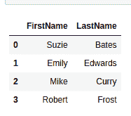
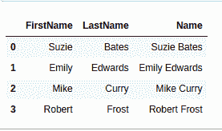
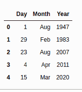

# 如何连接熊猫数据框中的列值？

> 原文:[https://www . geeksforgeeks . org/如何连接-列值-in-pandas-dataframe/](https://www.geeksforgeeks.org/how-to-concatenate-column-values-in-pandas-dataframe/)

很多时候，我们需要将不同列中的值组合成一列。可以有许多这样的用例，比如在一个列表中组合人的名字和姓氏，将日、月和年组合成一列日期，等等。现在我们将通过一些例子来看看如何实现这一点。

**示例 1:** 在本例中，我们将把两列名姓组合成一个列名。为了实现这一点，我们将使用地图功能。

```py
import pandas as pd
from pandas import DataFrame 

# creating a dictionary of names
Names = {'FirstName':['Suzie','Emily','Mike','Robert'],
         'LastName':['Bates','Edwards','Curry','Frost']}

# creating a dataframe from dictionary
df = DataFrame(Names, columns=['FirstName','LastName'])
print(df)

print('\n')

# concatenating the columns
df['Name'] = df['FirstName'].map(str) + ' ' + df['LastName'].map(str)
print(df)
```

**输出:**




**示例 2:** 同样，我们可以在一个数据帧中连接任意数量的列。让我们通过另一个例子来看看如何在一个单独的日期列中连接日、月和年这三个不同的列。

```py
import pandas as pd
from pandas import DataFrame 

# creating a dictionary of Dates
Dates = {'Day': [1, 29, 23, 4, 15], 
        'Month': ['Aug', 'Feb', 'Aug', 'Apr', 'Mar'], 
        'Year': [1947, 1983, 2007, 2011, 2020]}

# creating a dataframe from dictionary
df = DataFrame(Dates, columns = ['Day', 'Month', 'Year'])
print (df)

print('\n')

# concatenating the columns
df['Date'] = df['Day'].map(str) + '-' + df['Month'].map(str) + '-' + df['Year'].map(str)
print (df)
```

**输出:**




**例 3:**

我们可以更进一步，从多个不同的数据帧中连接多个列。在本例中，我们将数据帧 df1 和 df2 的列组合成一个数据帧。

```py
import pandas as pd
from pandas import DataFrame 

# creating a dictionary of Dates
Dates = {'Day': [1, 1, 1, 1], 
        'Month': ['Jan', 'Jan', 'Jan', 'Jan'], 
        'Year': [2017, 2018, 2019, 2020]} 

# creating a dataframe from dictionary
df1 = DataFrame(Dates, columns = ['Day', 'Month', 'Year']) 

# creating a dictionary of Rates
Rates = {'GDP': [5.8, 7.6, 5.6, 4.1], 
         'Inflation Rate': [2.49, 4.85, 7.66, 6.08]} 

# creating a dataframe from dictionary
df2 = DataFrame(Rates, columns = ['GDP', 'Inflation Rate'])

# combining columns of df1 and df2
df_combined = df1['Day'].map(str) + '-' + df1['Month'].map(str) + '-' + df1['Year'].map(str) + ': ' + 'GDP: ' + df2['GDP'].map(str) + '; ' + 'Inflation: ' + df2['Inflation Rate'].map(str)
print (df_combined)
```

**输出:**

