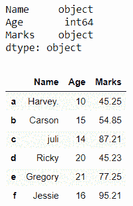
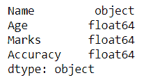
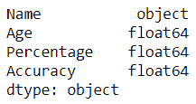
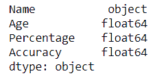

# 熊猫数据帧中如何将浮点数转换为字符串？

> 原文:[https://www . geesforgeks . org/如何将浮动转换为熊猫字符串-dataframe/](https://www.geeksforgeeks.org/how-to-convert-floats-to-strings-in-pandas-dataframe/)

在这篇文章中，我们将在熊猫数据框中看到将浮点转换为字符串的不同方法？熊猫[数据框](https://www.geeksforgeeks.org/python-pandas-dataframe/)提供了更改列值数据类型的自由。我们可以将它们从整数更改为浮点类型、整数更改为字符串、字符串更改为整数、浮点更改为字符串等。

有三种方法可以将浮点转换为字符串:

**方法 1:** 使用[**data frame . astype()**](https://www.geeksforgeeks.org/python-pandas-dataframe-astype/)。

**语法**:

```
DataFrame.astype(dtype, copy=True, errors=’raise’, **kwargs)

```

这用于将 pandas 对象转换为指定的数据类型。该函数还提供了将任何合适的现有列转换为分类类型的功能。

**例 1:** 将**一**列从浮点转换为字符串。

## 蟒蛇 3

```
# Import pandas library 
import pandas as pd 

# initialize list of lists 
data = [['Harvey', 10, 45.25], ['Carson', 15, 54.85],
        ['juli', 14, 87.21], ['Ricky', 20, 45.23],
        ['Gregory', 21, 77.25], ['Jessie', 16, 95.21]] 

# Create the pandas DataFrame 
df = pd.DataFrame(data, columns = ['Name', 'Age', 'Marks'],
                  index = ['a', 'b', 'c', 'd', 'e', 'f']) 

# lets find out the data type 
# of 'Marks' column
print (df.dtypes)
```

**输出:**


现在，我们将列“**标记”**的数据类型从“float64”更改为“object”。

## 蟒蛇 3

```
# Now we will convert it from 
# 'float' to 'String' type. 
df['Marks'] = df['Marks'].astype(str)

print()

# lets find out the data
# type after changing
print(df.dtypes)

# print dataframe. 
df 
```

**输出:**



**例 2:** 将**多于**的一列从浮点数转换为字符串。

## 蟒蛇 3

```
# Import pandas library 
import pandas as pd 

# initialize list of lists 
data = [['Harvey.', 10.5, 45.25, 95.2], ['Carson', 15.2, 54.85, 50.8], 
        ['juli', 14.9, 87.21, 60.4], ['Ricky', 20.3, 45.23, 99.5],
        ['Gregory', 21.1, 77.25, 90.9], ['Jessie', 16.4, 95.21, 10.85]] 

# Create the pandas DataFrame 
df = pd.DataFrame(data, columns = ['Name', 'Age', 'Marks', 'Accuracy'],
                  index = ['a', 'b', 'c', 'd', 'e', 'f']) 

# lets find out the data type 
# of 'Age' and 'Accuracy' columns
print (df.dtypes)
```

**输出:**



现在，我们将列“**精度**”和“**年龄**”的数据类型从“float64”更改为“object”。

## 蟒蛇 3

```
# Now Pass a dictionary to 
# astype() function which contains 
# two columns and hence convert them
# from float to string type
df = df.astype({"Age": 'str', "Accuracy": 'str'})
print()

# lets find out the data 
# type after changing
print(df.dtypes)

# print dataframe. 
df 
```

**输出:**


**方法二:**使用 [**系列。**](https://www.geeksforgeeks.org/python-pandas-apply/) 。

**语法**:

```
DataFrame.apply(func, axis=0, raw=False, result_type=None, args=(), **kwds)

```

这个方法允许用户传递一个函数，并将其应用于熊猫系列的每个值。

**示例:**将数据框的列从浮点转换为字符串。

## 蟒蛇 3

```
# Import pandas library 
import pandas as pd 

# initialize list of lists 
data = [['Harvey.', 10.5, 45.25, 95.2], ['Carson', 15.2, 54.85, 50.8],
        ['juli', 14.9, 87.21, 60.4], ['Ricky', 20.3, 45.23, 99.5],
        ['Gregory', 21.1, 77.25, 90.9], ['Jessie', 16.4, 95.21, 10.85]] 

# Create the pandas DataFrame 
df = pd.DataFrame(data, columns = ['Name', 'Age', 'Percentage', 'Accuracy'],
                  index = ['a', 'b', 'c', 'd', 'e', 'f']) 

# lets find out the data 
# type of 'Percentage' column
print (df.dtypes)
```

**输出:**



现在，我们将列“**percent**”的数据类型从“float64”更改为“object”。

## 蟒蛇 3

```
# Now we will convert it from 
# 'float' to 'string' type. 
df['Percentage'] = df['Percentage'].apply(str) 
print()

# lets find out the data
# type after changing
print(df.dtypes)

# print dataframe. 
df
```

**输出:**


**方法 3** :使用 [**Series.map()**](https://www.geeksforgeeks.org/python-pandas-map/) 。

**语法:**

```
Series.map(arg, na_action=None)

```

此方法用于映射同一列中两个系列的值。

**示例:**将数据帧的列从浮点转换为字符串。

## 蟒蛇 3

```
# Import pandas library 
import pandas as pd 

# initialize list of lists 
data = [['Harvey.', 10.5, 45.25, 95.2], ['Carson', 15.2, 54.85, 50.8], 
        ['juli', 14.9, 87.21, 60.4], ['Ricky', 20.3, 45.23, 99.5],
        ['Gregory', 21.1, 77.25, 90.9], ['Jessie', 16.4, 95.21, 10.85]] 

# Create the pandas DataFrame 
df = pd.DataFrame(data, columns = ['Name', 'Age', 'Percentage', 'Accuracy'],
                  index = ['a', 'b', 'c', 'd', 'e', 'f']) 

# lets find out the data
# type of 'Age' column
print (df.dtypes)
```

**输出:**



现在，我们将列“ **Age** ”的数据类型从“float64”更改为“object”。

## 蟒蛇 3

```
# Now we will convert it from 'float' to 'string' type. 
# using DataFrame.map(str) function
df['Age'] = df['Age'].map(str)  
print()

# lets find out the data type after changing
print(df.dtypes)

# print dataframe. 
df 
```

**输出:**

