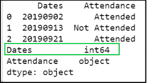
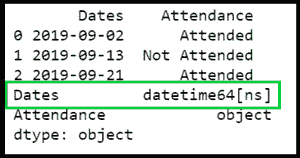

# 熊猫 DataFrame 中如何将整数转换为 Datetime？

> 原文:[https://www . geesforgeks . org/如何将整数转换为熊猫中的日期时间-dataframe/](https://www.geeksforgeeks.org/how-to-convert-integer-to-datetime-in-pandas-dataframe/)

让我们讨论一下如何在其中将整数转换为 Datetime。现在要在熊猫数据帧中将整数转换为日期时间，我们可以使用以下语法:

> df['数据框列'] = pd.to_datetime(df['数据框列']，格式=指定您的格式)

**注意:**整数数据必须符合指定的格式。

**示例#1:**

## 计算机编程语言

```
# importing pandas package
import pandas as pd

# creating a dataframe
values = {'Dates':  [20190902, 20190913, 20190921],
          'Attendance': ['Attended', 'Not Attended', 'Attended']
          }

df = pd.DataFrame(values, columns=['Dates', 'Attendance'])

# display
print(df)
print(df.dtypes)
```

**输出:**

[](https://media.geeksforgeeks.org/wp-content/uploads/20200627042156/gfgbeforedatetime-300x170.png)

我们可以看到，“日期”列的数据类型是整数。现在，为了将其转换为 Datetime，我们使用前面提到的语法。由于在本例中日期格式是 **yyyymmdd** ，日期格式可以表示如下:

```
format= '%Y%m%d'

```

对于我们的示例，将整数转换为日期时间的完整代码是:

## 计算机编程语言

```
# importing pandas package
import pandas as pd

# creating the dataframe
values = {'Dates':  [20190902, 20190913, 20190921],
          'Attendance': ['Attended', 'Not Attended', 'Attended']
          }

df = pd.DataFrame(values, columns=['Dates', 'Attendance'])

# converting the integers to datetime format
df['Dates'] = pd.to_datetime(df['Dates'], format='%Y%m%d')

# display
print(df)
print(df.dtypes)
```

**输出**:

[](https://media.geeksforgeeks.org/wp-content/uploads/20200627041838/gfgdatetimeoutput-300x158.png)

**示例#2:** 现在，假设数据框具有格式为 **yymmdd** 的日期。在这种情况下，日期格式现在将包含小写的**‘y’**:

```
format='%y%m%d'

```

因此完整的 Python 代码如下所示:

## 计算机编程语言

```
# importing pandas package
import pandas as pd

# creating dataframe
values = {'Dates':  [190902, 190913, 190921],
          'Attendance': ['Attended', 'Not Attended', 'Attended']
          }

df = pd.DataFrame(values, columns=['Dates', 'Attendance'])

# changing the integer dates to datetime format
df['Dates'] = pd.to_datetime(df['Dates'], format='%y%m%d')

# display
print(df)
print(df.dtypes)
```

**输出:**

[](https://media.geeksforgeeks.org/wp-content/uploads/20200627043521/gfgdatetimeoutput2-300x154.png)

**示例#3:** 现在，让我们假设您的整数包含日期和时间。在这种情况下，您应该指定的格式是:

```
format='%Y%m%d%H%M%S'

```

所以完整的 Python 代码应该是:

## 计算机编程语言

```
# importing pandas package
import pandas as pd

# creating dataframe
values = {'Dates': [20190902093000, 20190913093000, 20190921200000],
          'Attendance': ['Attended', 'Not Attended', 'Attended']
          }

df = pd.DataFrame(values, columns=['Dates', 'Attendance'])

# changing integer values to datetime format
df['Dates'] = pd.to_datetime(df['Dates'], format='%Y%m%d%H%M%S')

# display
print(df)
print(df.dtypes)
```

**输出:**

[](https://media.geeksforgeeks.org/wp-content/uploads/20200627045003/gfgtimeoutput-300x120.png)

**示例#4:** 考虑我们的日期时间值中以微秒为单位的数据帧。在这种情况下，格式应指定为:

```
format='%Y%m%d%H%M%S%F'

```

所以完整的 Python 代码将是:

## 计算机编程语言

```
# importing pandas package
import pandas as pd

# creating dataframe
values = {'Dates':  [20190902093000912, 20190913093000444, 
                     20190921200000009],
          'Attendance': ['Attended', 'Not Attended', 'Attended']
          }

df = pd.DataFrame(values, columns=['Dates', 'Attendance'])

# changing the integer dates to datetime format
df['Dates'] = pd.to_datetime(df['Dates'], format='%Y%m%d%H%M%S%F')

# display
print(df)
print(df.dtypes)
```

**输出:**

[](https://media.geeksforgeeks.org/wp-content/uploads/20200627052024/gfgmicrosecond-300x117.png)