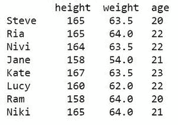

# 如何计算熊猫数据框列的不同值？

> 原文:[https://www . geesforgeks . org/如何计算熊猫的不同值-数据框-列/](https://www.geeksforgeeks.org/how-to-count-distinct-values-of-a-pandas-dataframe-column/)

让我们看看如何计算熊猫数据帧列的不同值？

考虑下面给出的表格结构，它必须被创建为数据帧。栏目为**身高、体重、年龄**。8 名学生的记录形成一排排。

<figure class="table">

|   | **高度** | **重量** | **年龄** |
| **史蒂夫** | 165    | 63.5    | Twenty |
| 笑 | 165     | 64   | Twenty-two |
| nivi | 164    | Sixty-three point five | Twenty-two |
| 简 | 158     | Fifty-four | Twenty-one |
| 凯特 | 167    | Sixty-three point five | Twenty-three |
| 露西 | 160    | Sixty-two | Twenty-two |
| ram | 158     | Sixty-four | Twenty |
| niki | One hundred and sixty-five | Sixty-four | Twenty-one |

</figure>

第一步是为上面的列表创建数据框。请看下面的代码片段。

## 蟒蛇 3

```
# import library
import pandas as pd

# create a Dataframe
df = pd.DataFrame({ 
  'height' : [165, 165, 164, 
              158, 167, 160,
              158, 165],

  'weight' : [63.5, 64, 63.5,
              54, 63.5, 62,
              64, 64],

  'age' : [20, 22, 22, 
           21, 23, 22,
           20, 21]},

   index = ['Steve', 'Ria', 'Nivi', 
            'Jane', 'Kate', 'Lucy',
            'Ram', 'Niki'])

# show the Dataframe
df
```

**输出:**



**方法 1:** 使用**进行循环。**

数据框已经创建，可以使用**对循环**进行硬编码，并计算特定列中唯一值的数量。例如，在上表中，如果希望计算**高度**栏中唯一值的数量。想法是使用变量 **cnt** 来存储计数和具有先前访问值的列表**。然后，对于遍历“高度”列的循环，对于每个值，它检查在访问列表中是否已经访问过相同的值。如果以前没有访问过该值，则计数增加 1。**

**下面是实现:**

## **蟒蛇 3**

```
# import library
import pandas as pd

# create a Dataframe
df = pd.DataFrame({ 
  'height' : [165, 165, 164, 
              158, 167, 160,
              158, 165],

  'weight' : [63.5, 64, 63.5,
              54, 63.5, 62,
              64, 64],

  'age' : [20, 22, 22, 
           21, 23, 22,
           20, 21]},

   index = ['Steve', 'Ria', 'Nivi', 
            'Jane', 'Kate', 'Lucy',
            'Ram', 'Niki'])

# variable to hold the count
cnt = 0

# list to hold visited values
visited = []

# loop for counting the unique
# values in height
for i in range(0, len(df['height'])):

    if df['height'][i] not in visited: 

        visited.append(df['height'][i])

        cnt += 1

print("No.of.unique values :",
      cnt)

print("unique values :",
      visited)
```

****输出:****

```
No.of.unique values : 5
unique values : [165, 164, 158, 167, 160] 
```

**但是，当数据框变大并包含数千行和数千列时，这种方法就不那么有效了。为了提高效率，下面列出了三种方法:**

*   ****熊猫.独特()****
*   ****data frame . nuneme()****
*   ****Series.value_counts()****

****方法二:**采用**独有的()。****

**唯一方法将一维数组或序列作为输入，并返回其中唯一项的列表。返回值是一个 NumPy 数组，其中的内容基于传递的输入。如果提供索引作为输入，那么返回值也将是唯一值的索引。**

> ****语法:**熊猫.独特(系列)**

****示例:****

## **蟒蛇 3**

```
# import library
import pandas as pd

# create a Dataframe
df = pd.DataFrame({ 
  'height' : [165, 165, 164, 
              158, 167, 160,
              158, 165],

  'weight' : [63.5, 64, 63.5,
              54, 63.5, 62,
              64, 64],

  'age' : [20, 22, 22, 
           21, 23, 22,
           20, 21]},

   index = ['Steve', 'Ria', 'Nivi', 
            'Jane', 'Kate', 'Lucy',
            'Ram', 'Niki'])

# counting unique values
n = len(pd.unique(df['height']))

print("No.of.unique values :", 
      n)
```

****输出:****

```
No.of.unique values : 5 
```

****方法三:**使用**[**data frame . nunice()**](https://www.geeksforgeeks.org/python-pandas-dataframe-nunique/)**。******

****此方法返回指定轴中唯一值的计数。语法是:****

> ******语法:**data frame . never(axis = 0/1，dropna=True/False)****

******示例:******

## ****蟒蛇 3****

```
**# import library
import pandas as pd

# create a Dataframe
df = pd.DataFrame({ 
  'height' : [165, 165, 164, 
              158, 167, 160,
              158, 165],

  'weight' : [63.5, 64, 63.5,
              54, 63.5, 62,
              64, 64],

  'age' : [20, 22, 22, 
           21, 23, 22,
           20, 21]},

   index = ['Steve', 'Ria', 'Nivi', 
            'Jane', 'Kate', 'Lucy',
            'Ram', 'Niki'])

# check the values of 
# each row for each column
n = df.nunique(axis=0)

print("No.of.unique values in each column :\n",
      n)**
```

******输出:******

```
**No.of.unique values in each column :
height    5
weight    4
age       4
dtype: int64** 
```

****要获取指定列中唯一值的数量:****

> ******语法:**data frame . col _ name . never()****

******示例:******

## ****蟒蛇 3****

```
**# import library
import pandas as pd

# create a Dataframe
df = pd.DataFrame({ 
  'height' : [165, 165, 164, 
              158, 167, 160,
              158, 165],

  'weight' : [63.5, 64, 63.5,
              54, 63.5, 62,
              64, 64],

  'age' : [20, 22, 22, 
           21, 23, 22,
           20, 21]},

   index = ['Steve', 'Ria', 'Nivi', 
            'Jane', 'Kate', 'Lucy',
            'Ram', 'Niki'])

# count no. of unique 
# values in height column
n = df.height.nunique()

print("No.of.unique values in height column :",
      n)**
```

******输出:******

```
**No.of.unique values in height column : 5** 
```

******方法三:**使用**[**series . value _ counts()**](https://www.geeksforgeeks.org/python-pandas-series-value_counts/)**。********

****此方法返回指定列中所有唯一值的计数。****

> ******语法:**series . value _ counts(normalize =False，sort=True，升序= False，bins = None，dropna=True)****

******示例:******

## ****蟒蛇 3****

```
**# import library
import pandas as pd

# create a Dataframe
df = pd.DataFrame({ 
  'height' : [165, 165, 164, 
              158, 167, 160,
              158, 165],

  'weight' : [63.5, 64, 63.5,
              54, 63.5, 62,
              64, 64],

  'age' : [20, 22, 22, 
           21, 23, 22,
           20, 21]},

   index = ['Steve', 'Ria', 'Nivi', 
            'Jane', 'Kate', 'Lucy',
            'Ram', 'Niki'])

# getting the list of unique values
li = list(df.height.value_counts())

# print the unique value counts
print("No.of.unique values :",
      len(li))**
```

******输出:******

```
**No.of.unique values : 5** 
```