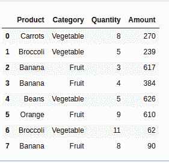
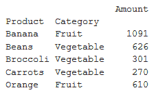
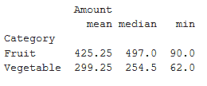
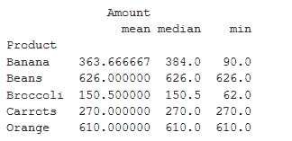

# 如何用熊猫在 Python 中创建透视表？

> 原文:[https://www . geeksforgeeks . org/如何使用 pandas 创建 python 透视表/](https://www.geeksforgeeks.org/how-to-create-a-pivot-table-in-python-using-pandas/)

数据透视表是一个统计表，它总结了一个像大数据集一样的大表。这是数据处理的一部分。数据透视表中的汇总可能包括平均值、中位数、总和或其他统计术语。透视表最初与 MS Excel 相关联，但是我们可以使用 Pandas 使用 [dataframe.pivot()](https://www.geeksforgeeks.org/python-pandas-pivot_table/) 方法在 Python 中创建一个透视表。

> **语法:** dataframe.pivot(self，索引=无，列=无，值=无，aggfunc)
> 
> **参数–**
> **索引:**列用于制作新帧的索引。
> **列:**列为新框架的列。
> **值:**用于填充新帧值的列。
> **aggfunc:** 函数，函数列表，dict，默认 numpy.mean

**示例 1:**
让我们首先创建一个包含水果销售的数据框。

```
# importing pandas
import pandas as pd

# creating dataframe
df = pd.DataFrame({'Product' : ['Carrots', 'Broccoli', 'Banana', 'Banana',
                                'Beans', 'Orange', 'Broccoli', 'Banana'],
                   'Category' : ['Vegetable', 'Vegetable', 'Fruit', 'Fruit',
                                 'Vegetable', 'Fruit', 'Vegetable', 'Fruit'],
                   'Quantity' : [8, 5, 3, 4, 5, 9, 11, 8],
                   'Amount' : [270, 239, 617, 384, 626, 610, 62, 90]})
df
```

**输出:**



**获取每款产品的总销量**

```
# creating pivot table of total sales
# product-wise aggfunc = 'sum' will 
# allow you to obtain the sum of sales
# each product
pivot = df.pivot_table(index =['Product'],
                       values =['Amount'],
                       aggfunc ='sum')
print(pivot)
```

**输出:**


**获取各品类总销量**

```
# creating pivot table of total 
# sales category-wise aggfunc = 'sum'
# will allow you to obtain the sum of
# sales each product
pivot = df.pivot_table(index =['Category'], 
                       values =['Amount'], 
                       aggfunc ='sum')
print(pivot)
```

**输出:**


**按类别和产品获取总销售额**

```
# creating pivot table of sales
# by product and category both
# aggfunc = 'sum' will allow you
# to obtain the sum of sales each
# product
pivot = df.pivot_table(index =['Product', 'Category'], 
                       values =['Amount'], aggfunc ='sum')
print (pivot)
```

**输出–**


**按类别获取平均、中间、最低销售额**

```
# creating pivot table of Mean, Median,
# Minimum sale by category aggfunc = {'median',
# 'mean', 'min'} will get median, mean and 
# minimum of sales respectively
pivot = df.pivot_table(index =['Category'], values =['Amount'], 
                       aggfunc ={'median', 'mean', 'min'})
print (pivot)
```

**输出–**


**获取产品的平均、中值、最低销售额**

```
# creating pivot table of Mean, Median,
# Minimum sale by product aggfunc = {'median',
# 'mean', 'min'} will get median, mean and
# minimum of sales respectively
pivot = df.pivot_table(index =['Product'], values =['Amount'],
                       aggfunc ={'median', 'mean', 'min'})
print (pivot)
```

**输出:**
