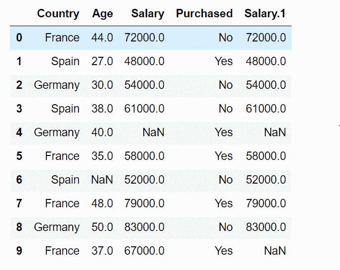
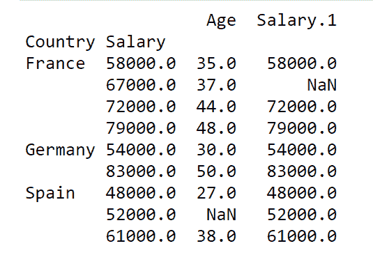
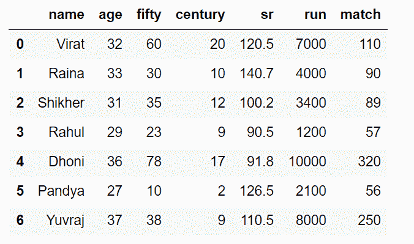

# 如何在 Python 中使用 Pandas 从 excel 工作表创建一个包含多个索引的透视表？

> 原文:[https://www . geeksforgeeks . org/如何使用 python 中的熊猫从 excel 工作表创建具有多个索引的透视表/](https://www.geeksforgeeks.org/how-to-create-a-pivot-table-with-multiple-indexes-from-an-excel-sheet-using-pandas-in-python/)

术语[透视表](https://www.geeksforgeeks.org/python-pandas-pivot_table/)可以定义为熊猫函数，用于创建电子表格样式的透视表作为数据框。可以使用 [pivot_table()](https://www.geeksforgeeks.org/python-pandas-pivot_table/) 方法创建。

> **语法:** pandas.pivot_table(数据，索引=无)
> 
> **参数:**
> 
> **数据:**数据框
> 索引:列、石斑鱼、数组或之前的列表
> 
> **索引:**它是允许您对数据进行分组的功能。
> 
> **返回:**数据帧

**注意:**我们可以通过添加可选参数来进一步过滤表格。

**示例 1:** 链接到 CSV 文件: [CSV 文件](https://docs.google.com/spreadsheets/d/1xCfGTuY9rbNE7_JJ5LS4OntfyXxLGNR_6ty_J-tWz0U/edit?usp=sharing)
我们可以通过运行以下程序来查看数据:

## 蟒蛇 3

```
# importing pandas as pd 
import pandas as pd

# Create the dataframe 
df=pd.read_csv('GeeksForGeeks.csv')

# Print the dataframe 
df
```

**输出:**



我们知道，索引是一种功能，它允许我们对数据进行分组，并在 pivot 函数中指定多个列作为索引，从而提高了数据的详细程度和分组程度。
在表中保留单个索引:

## 蟒蛇 3

```
# importing pandas as pd 
import pandas as pd

# Create the dataframe 
df=pd.read_csv('GeeksForGeeks.csv')

# Print the resultant table
print(pd.pivot_table(df,index=["Country"]))
```

**输出:**


正如我们所看到的，分组是按国家进行的，数字数据被打印为与指定索引相关的所有值的平均值。
现在，在表中保留多个索引:

## 蟒蛇 3

```
# importing pandas as pd 
import pandas as pd

# Create the dataframe 
df=pd.read_csv('GeeksForGeeks.csv')

# Print the resultant table
print(pd.pivot_table(df,index=["Country","Salary"]))
```

**输出:**



**示例** **2:** 链接到 CSV 文件: [CSV 文件](https://docs.google.com/spreadsheets/d/15iWNM9CGeK91eld8P4xc51BjOmniogjaj0EoGfAEhDk/edit?usp=sharing)

## 蟒蛇 3

```
# importing pandas as pd 
import pandas as pd

# Create the dataframe 
df=pd.read_csv('GeeksForGeeks_1.csv')

# Print the dataframe 
df
```

**输出:**



将玩家得分的世纪数和他们的名字作为索引，我们得到:

## 蟒蛇 3

```
# importing pandas as pd 
import pandas as pd

# Create the dataframe 
df=pd.read_csv('dataset/new_players.csv')

# Print the resultant table
print(pd.pivot_table(df,index=["century","name"]))
```

**输出:**

