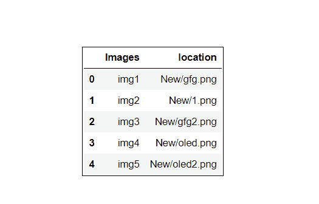
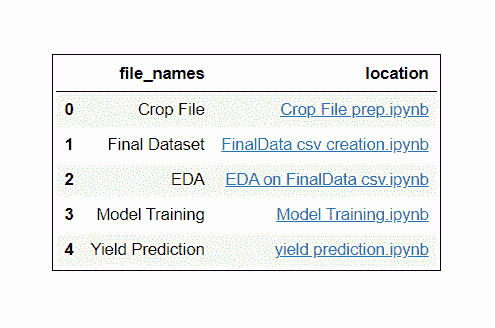

# 如何在 Pandas 中创建一个带有指向本地文件的可点击超链接的表格？

> 原文:[https://www . geeksforgeeks . org/如何创建一个可点击超级链接到熊猫本地文件的表格/](https://www.geeksforgeeks.org/how-to-create-a-table-with-clickable-hyperlink-to-a-local-file-in-pandas/)

如果你熟悉数据科学或机器学习领域，那么我们可以肯定地说，我们将从这篇文章中学到一些新的东西，所以让我们开始吧。在本文中，我们将学习如何使用熊猫创建本地文件路径的可点击超链接。这不是一个非常复杂的任务，我们只需要 4 到 5 步就可以轻松完成。让我们更深入地了解它，并讨论所需的库。

*   **Pandas:** 它是 python 中最受欢迎、最受欢迎的数据扯皮和分析库之一。熊猫是所有数据科学和机器学习项目的骨干。它是数据科学家和分析师最重要的工具之一。熊猫的一些特点是:数据处理，对齐和索引，处理丢失的数据，清理数据，合并和连接数据集，等等。这里我们也将使用熊猫来创建一个数据集。
*   **OS 库:**python 中存在的 OS 模块在各种项目中也扮演着非常重要的角色。它提供了许多与操作系统交互的功能。它还包括许多与文件系统交互的功能。在这里，我们必须处理本地文件，这就是为什么我们需要一个操作系统模块来处理它们。

**所需步骤**

**步骤 1:** 导入所需库。

## 蟒蛇 3

```
# Importing required libraries
import pandas as pd
import os as o
```

**步骤 2:** 使用字典和列表创建数据集。

## 蟒蛇 3

```
# Creating dataset of location of files.
dataset = [dict(Images = 'img1', location = r'New/gfg.png'),
           dict(Images = 'img2', location = r'New/1.png'),
           dict(Images = 'img3', location = r'New/gfg2.png'),
           dict(Images = 'img4', location = r'New/oled.png'),
           dict(Images = 'img5', location = r'New/oled2.png')]
```

在上面的代码片段中，我们创建了一个本地系统中本地文件路径的小数据集。首先，我们正在创建一个字典，其中图像名称充当唯一键，图像的路径充当唯一键的值。最后，把字典转换成一个列表，这样我们就可以很容易地把列表转换成熊猫的数据帧。

**第三步:**将列表转换为数据帧并打印。

## 蟒蛇 3

```
# Converting list into pandas dataframe 
df = pd.DataFrame(dataset)

# printing the dataframe
df
```

**输出:**



直到第 2 步，我们的数据帧都是列表形式的，所以在第 3 步，我们将它转换成熊猫的数据帧，这样我们就可以很容易地对它进行几十个操作，以便进行更好的分析。目前，图像的路径不是可点击的形式，我们必须对其执行一些棘手的操作才能转换成可点击的超链接形式。

**第四步:**创建一个函数，将路径转换成可点击的形式。

## 蟒蛇 3

```
# Function to convert file path into clickable form.
def fun(path):

    # returns the final component of a url
    f_url = o.path.basename(path)

    # convert the url into link
    return '<a href="{}">{}</a>'.format(path, f_url)
```

在上面的代码片段中，我们创建了一个将文件路径(文件位置)转换为可点击超链接形式的函数。

**第五步:**在“位置”栏应用功能，将路径转换为可点击的超链接形式。现在，每当我们打印数据帧时，我们都会得到所需的输出。**T3】**

## 蟒蛇 3

```
# applying function "fun" on column "location".
df = df.style.format({'location' : fun})
```

**输出:**


最后，我们已经成功地将本地文件路径转换为可点击的超链接形式。让我们来看看一些例子。

**示例 1:创建一个** **数据框，其中包含本地系统中图像的可点击超链接路径。**

## 蟒蛇 3

```
# Step 1 : Importing required modules
import pandas as pd
import os

# Step 2 : Creating dataset of local path images
dataset = [dict(Images='img1', location=r'New/gfg.png'),
           dict(Images='img2', location=r'New/1.png'),
           dict(Images='img3', location=r'New/gfg2.png'),
           dict(Images='img4', location=r'New/oled.png'),
           dict(Images='img5', location=r'New/oled2.png')]

# Step 3 : Converting list into dataframe
df = pd.DataFrame(dataset)

# Function to convert file path into clickable form.

def fun(path):

    # returns the final component of a path
    f_url = os.path.basename(path)

    # convert the path into clickable link
    return '<a href="{}">{}</a>'.format(path, f_url)

# applying function "fun" on column "location".
df = df.style.format({'location': fun})

# Step 5 : Finally printing Dataframe
df
```

**输出:**


**示例 2:创建包含本地系统中存在的文件的** **可点击超链接路径的数据框。**

## 蟒蛇 3

```
# Step 1 : Importing required modules
import pandas as pd
import os

# Step 2 : Creating dataset of files
dataset = [dict(
  file_names='Crop File', location=r'ML/Crop File prep.ipynb'),

           dict(
  file_names='Final Dataset', location=r'ML/FinalData csv creation.ipynb'),

           dict(
  file_names='EDA', location=r'ML/EDA on FinalData csv.ipynb'),

           dict(
  file_names='Model Training', location=r'ML/Model Training.ipynb'),

           dict(
  file_names='Yield Prediction', location=r'ML/yield prediction.ipynb')]

# Step 3 : Converting list into dataframe
df = pd.DataFrame(data)

# Function to convert file path into 
# clickable hyperlink form.
def fun(path):

    # returns the final component of a path
    f_url = os.path.basename(path)

    # convert the path into clickable hyperlink
    return '<a href="{}">{}</a>'.format(path, f_url)

# Step 4 : applying make_clikable function 
# on column path.
df = df.style.format({'location': fun})

# Step 5 : Finally printing Dataframe
df
```

**输出:**



**注意:**每当我们试图从浏览器加载本地文件时，我们的浏览器都会不断出现“不允许加载本地资源”的错误。如果我们谷歌这个问题，并知道这是由于我们的系统的一些安全问题。但是有一种方法可以解决这个问题，而不干扰我们的系统安全，将所需的文件放在我们工作的同一工作目录中。在上面的例子中，我们创建了一个文件夹，并将所有需要的文件放入其中，最后轻松地加载它们，没有任何问题。在示例 1 中，我们在我的工作目录中创建了一个名为“New”的文件夹，并将所有必需的文件放入其中，与示例 2 中的情况类似。