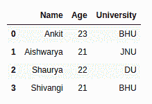
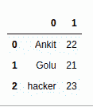
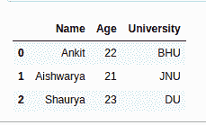

# 如何用 Python 从字典中创建 data frame-Pandas？

> 原文:[https://www . geeksforgeeks . org/如何从 python 字典创建数据框架-pandas/](https://www.geeksforgeeks.org/how-to-create-dataframe-from-dictionary-in-python-pandas/)

让我们讨论一下如何从熊猫的字典中创建数据帧。有多种方法可以完成这项任务。

**方法 1:** 使用熊猫的默认构造函数从字典中创建数据帧。Dataframe 类。

**代码:**

```
# import pandas library
import pandas as pd

# dictionary with list object in values
details = {
    'Name' : ['Ankit', 'Aishwarya', 'Shaurya', 'Shivangi'],
    'Age' : [23, 21, 22, 21],
    'University' : ['BHU', 'JNU', 'DU', 'BHU'],
}

# creating a Dataframe object 
df = pd.DataFrame(details)

df
```

**输出:**



**方法 2:** 使用用户定义的索引从字典创建数据帧。

**代码:**

```
# import pandas library
import pandas as pd

# dictionary with list object in values
details = {
    'Name' : ['Ankit', 'Aishwarya', 'Shaurya', 'Shivangi'],
    'Age' : [23, 21, 22, 21],
    'University' : ['BHU', 'JNU', 'DU', 'BHU'],
}

# creating a Dataframe object from dictionary 
# with custom indexing
df = pd.DataFrame(details, index = ['a', 'b', 'c', 'd'])

df
```

**输出:**


**方法 3:** 从简单字典创建数据帧，即带有关键字和简单值(如整数值或字符串值)的字典。

**代码:**

```
# import pandas library
import pandas as pd

# dictionary
details = {
    'Ankit' : 22,
    'Golu' : 21,
    'hacker' : 23
    }

# creating a Dataframe object from a list 
# of tuples of key, value pair
df = pd.DataFrame(list(details.items()))

df
```

**输出:**



**方法 4:** 从字典中创建仅包含所需列的数据框。

**代码:**

```
# import pandas library
import pandas as pd

# dictionary with list object in values
details = {
    'Name' : ['Ankit', 'Aishwarya', 'Shaurya', 'Shivangi'],
    'Age' : [23, 21, 22, 21],
    'University' : ['BHU', 'JNU', 'DU', 'BHU'],
}

# creating a Dataframe object with skipping 
# one column i.e skipping age column.
df = pd.DataFrame(details, columns = ['Name', 'University'])

df
```

**输出:**


**方法 5:** 从不同方向的字典中创建数据帧，即字典键作为数据帧中的索引。

**代码:**

```
# import pandas library
import pandas as pd

# dictionary with list object in values
details = {
    'Name' : ['Ankit', 'Aishwarya', 'Shaurya', 'Shivangi'],
    'Age' : [23, 21, 22, 21],
    'University' : ['BHU', 'JNU', 'DU', 'BHU'],
}

# creating a Dataframe object in which dictionary
# key is act as index value and column value is
# 0, 1, 2...
df = pd.DataFrame.from_dict(details, orient = 'index')

df
```

**输出:**


**方法 6:** 从嵌套字典创建数据帧。

**代码:**

```
# import pandas library
import pandas as pd

# dictionary with dictionary object
# in values i.e. nested dictionary
details = { 
    0 : {
        'Name' : 'Ankit',
        'Age' : 22,
        'University' : 'BHU'
        },
    1 : {
        'Name' : 'Aishwarya',
        'Age' : 21,
        'University' : 'JNU'
        },
    2 : {
        'Name' : 'Shaurya',
        'Age' : 23,
        'University' : 'DU'
        }
}

# creating a Dataframe object
# from nested dictionary
# in which inside dictionary
# key is act as index value
# and column value is 0, 1, 2...
df = pd.DataFrame(details)

# swap the columns with indexes
df = df.transpose()

df
```

**输出:**

