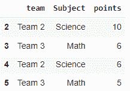
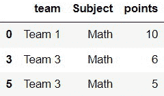

# 如何删除熊猫中包含特定字符串的行？

> 原文:[https://www . geesforgeks . org/如何删除包含特定字符串的行熊猫/](https://www.geeksforgeeks.org/how-to-drop-rows-that-contain-a-specific-string-in-pandas/)

在本文中，我们将看到如何删除熊猫中包含特定字符串的行。现在，要删除带有特定字符串的行，我们可以使用 pandas 库中的 [contains()](https://www.geeksforgeeks.org/python-pandas-series-str-contains/) 函数。

> **语法:** series.str.contains(字符串，大小写=真，标志=0，na =无，正则表达式=真)
> 
> **返回**–
> 
> 布尔值的系列或索引

基本上，这个函数将在给定的列中搜索字符串，并返回相应的行。为此，我们需要通过使用这个函数过滤数据帧来创建一个新的数据帧。

> **语法:**
> 
> df[ df["列"]. str . contains(" someString ")= = False]

**示例**:创建数据帧

## 蟒蛇 3

```
# Importing the library
import pandas as pd

# Dataframe
df = pd.DataFrame({'team': ['Team 1', 'Team 1', 'Team 2',
                            'Team 3', 'Team 2', 'Team 3'],
                   'Subject': ['Math', 'Science', 'Science',
                               'Math', 'Science', 'Math'],
                   'points': [10, 8, 10, 6, 6, 5]})

# display
df
```

**输出**:


## 方法 1:删除包含特定字符串的行

在这个方法中，我们将使用 str.contains()函数来查找行，该函数将基本上从序列中获取字符串，并检查给定字符串的匹配情况，并且使用布尔值来选择行并将它们设置为 False，这将有助于我们忽略选定的行并保留剩余的行。

> **语法:**df[df[" column _ name "]. str . contains(" string ")= = False]

**例**:

在下面的示例中，我们将选择除“团队 1”之外的所有团队。

## 蟒蛇 3

```
# importing the library
import pandas as pd

# Dataframe
df = pd.DataFrame({'team': ['Team 1', 'Team 1', 'Team 2',
                            'Team 3', 'Team 2', 'Team 3'],
                   'Subject': ['Math', 'Science', 'Science', 
                               'Math', 'Science', 'Math'],
                   'points': [10, 8, 10, 6, 6, 5]})

# Dropping the team 1
df = df[df["team"].str.contains("Team 1") == False]

df
```

**输出**:



## 方法 2:删除包含多个字符串的行

与方法 1 相同，我们在这里遵循相同的步骤，但是使用按位 or 运算符添加一个额外的字符串进行搜索。

> **语法:**df = df[df[" column _ name "]. str . contains(" string 1 | string 2 ")= = False]

**例**:

在下面的程序中，我们将删除包含“团队 1”或“团队 2”的行。

## 蟒蛇 3

```
# importing the library
import pandas as pd

# Dataframe
df = pd.DataFrame({'team': ['Team 1', 'Team 1', 'Team 2', 
                            'Team 3', 'Team 2', 'Team 3'],
                   'Subject': ['Math', 'Science', 'Science', 
                               'Math', 'Science', 'Math'],
                   'points': [10, 8, 10, 6, 6, 5]})

# Dropping the rows of team 1 and team 2
df = df[df["team"].str.contains("Team 1|Team 2") == False]

# display
df
```

**输出**:


## 方法 3:用给定的部分字符串删除行

在这里，我们使用相同的函数和一个连接方法，该方法携带我们需要搜索的那部分单词。

> **语法:**
> 
> df[~ df . column _ name . str . contains(' | ')。join([" string "])]

**示例:**

在下面这个程序中，情况与上面两种情况不同。在这里，我们将选择和删除带有给定部分字符串的行。例如，我们将删除列主题中带有“Sci”的行。

## 蟒蛇 3

```
# importing the library
import pandas as pd

# Dataframe
df = pd.DataFrame({'team': ['Team 1', 'Team 1', 'Team 2', 
                            'Team 3', 'Team 2', 'Team 3'],
                   'Subject': ['Math', 'Science', 'Science',
                               'Math', 'Science', 'Math'],
                   'points': [10, 8, 10, 6, 6, 5]})

# Dropping the rows with "Sci"
# identify partial string
discard = ["Sci"]

# drop rows that contain the partial string "Sci"
df[~df.Subject.str.contains('|'.join(discard))]

#display
df
```

**输出:**

