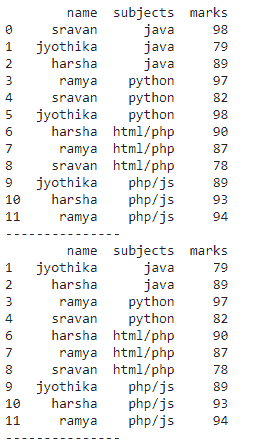

# 如何删除熊猫中包含特定值的行？

> 原文:[https://www . geeksforgeeks . org/如何删除包含特定熊猫值的行/](https://www.geeksforgeeks.org/how-to-drop-rows-that-contain-a-specific-value-in-pandas/)

在本文中，我们将讨论如何删除 Pandas 中包含特定值的行。删除行意味着从数据框中删除值我们可以通过使用条件或关系运算符来删除特定的值。

## 方法 1:使用运算符删除特定值

我们可以使用 column_name 函数和运算符来删除特定的值。

> **语法**:data frame[data frame . column _ name 运算符值]
> 
> 在哪里
> 
> *   数据帧是输入数据帧
> *   column_name 是要删除的列的值
> *   运算符是关系运算符
> *   value 是要从特定列中删除的特定值

### 使用不同的运算符删除列

## 蟒蛇 3

```
# import pandas module
import pandas as pd

# create dataframe with 4 columns
data = pd.DataFrame({

    "name": ['sravan', 'jyothika', 'harsha', 'ramya',
             'sravan', 'jyothika', 'harsha', 'ramya',
             'sravan', 'jyothika', 'harsha', 'ramya'],
    "subjects": ['java', 'java', 'java', 'python',
                 'python', 'python', 'html/php', 'html/php',
                 'html/php', 'php/js', 'php/js', 'php/js'],
    "marks": [98, 79, 89, 97, 82, 98, 90,
              87, 78, 89, 93, 94]
})

# display
print(data)

print("---------------")

# drop rows where value is 98
# by using not equal operator
print(data[data.marks != 98])

print("---------------")
```

**输出:**



## 方法 2:删除列表中包含值的行

通过使用这种方法，我们可以删除列表中存在的多个值，我们使用的是 [isin()](https://www.geeksforgeeks.org/python-pandas-dataframe-isin/) 运算符。该运算符用于检查列表中是否存在给定值

> **语法:**data frame[data frame . column _ name . isin(list _ of _ values)= = False]
> 
> 在哪里
> 
> *   数据帧是输入数据帧
> *   column_name 用于删除此列中的值
> *   list_of_values 是要删除的特定值

## 蟒蛇 3

```
# import pandas module
import pandas as pd

# create dataframe with 4 columns
data = pd.DataFrame({

    "name": ['sravan', 'jyothika', 'harsha', 'ramya',
             'sravan', 'jyothika', 'harsha', 'ramya', 
             'sravan', 'jyothika', 'harsha', 'ramya'],
    "subjects": ['java', 'java', 'java', 'python', 
                 'python', 'python', 'html/php', 
                 'html/php', 'html/php', 'php/js', 
                 'php/js', 'php/js'],
    "marks": [98, 79, 89, 97, 82, 98, 90, 87,
              78, 89, 93, 94]
})

# consider the list
list1 = [98, 82, 79]

# drop rows from above list
print(data[data.marks.isin(list1) == False])

print("---------------")

list2 = ['sravan', 'jyothika']
# drop rows from above list
print(data[data.name.isin(list2) == False])
```