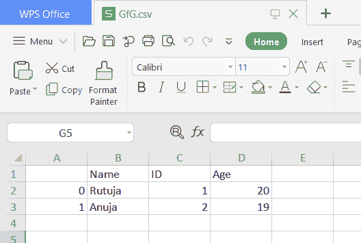
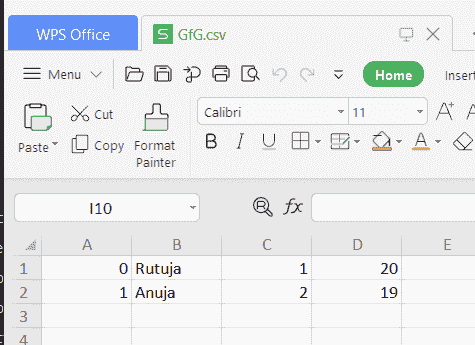

# 如何将熊猫数据帧导出到 CSV 文件？

> 原文:[https://www . geesforgeks . org/how-export-pandas-data frame-to-a-CSV-file/](https://www.geeksforgeeks.org/how-to-export-pandas-dataframe-to-a-csv-file/)

让我们看看如何将熊猫数据帧导出到 CSV 文件。我们将使用`[to_csv()](https://www.geeksforgeeks.org/saving-a-pandas-dataframe-as-a-csv/)`功能将数据帧保存为 CSV 文件。

## DataFrame.to_csv()

> **语法:**到 _csv(参数)
> **参数:**
> 
> *   **path_or_buf :** 文件路径或对象，如果未提供，结果将作为字符串返回。
> *   **sep :** 长度为 1 的字符串。输出文件的字段分隔符。
> *   **na_rep :** 缺少数据表示。
> *   **float_format :** 浮点数的格式字符串。
> *   **列:**要写的列。
> *   **标题:**如果给出了字符串列表，则假定它是列名的别名。
> *   **索引:**写行名(索引)。
> *   **索引标签:**索引列的列标签(如果需要)。如果没有给定，并且头和索引为真，则使用索引名。
> *   **模式:** Python 写模式，默认‘w’。
> *   **编码:**表示输出文件中使用的编码的字符串。
> *   **压缩:**以下可能值中的压缩模式:{ ' infer '，' gzip '，' bz2 '，' zip '，' xz '，None}。
> *   **报价:**默认为 csv。QUOTE _ MINIMAL。
> *   **quotechar :** 长度为 1 的字符串。用于引用字段的字符。
> *   **line_terminator :** 要在输出文件中使用的换行符或字符序列。
> *   **chunksize :** 一次写入的行数。
> *   **date_format :** 日期时间对象的格式字符串。
> *   **双引号:**控制字段内引号的引用。
> *   **擒纵符:**长度为 1 的字符串。用于在适当的时候转义 sep 和 quotechar 的字符。
> *   **小数:**识别为小数分隔符的字符。例如，欧洲数据使用'，'。
> 
> **返回:**无或字符串

**Example 1 :**

```py
# importing the module
import pandas as pd

# creating the DataFrame
my_df = {'Name': ['Rutuja', 'Anuja'], 
         'ID': [1, 2], 
         'Age': [20, 19]}
df = pd.DataFrame(my_df)

# displaying the DataFrame
print('DataFrame:\n', df)

# saving the DataFrame as a CSV file
gfg_csv_data = df.to_csv('GfG.csv', index = True)
print('\nCSV String:\n', gfg_csv_data)
```

**输出:**
执行代码前:


执行代码后:

我们可以清楚地看到。csv 文件已创建。

此外，上述代码的输出包括索引，如下所示。


**示例 2 :** 转换为没有索引的 CSV 文件。如果我们不希望包括索引，那么在`index` 参数中分配值`False`。

```py
# importing the module
import pandas as pd

# creating the DataFrame
my_df = {'Name': ['Rutuja', 'Anuja'], 
         'ID': [1, 2], 
         'Age': [20, 19]}
df = pd.DataFrame(my_df)

# displaying the DataFrame
print('DataFrame:\n', df)

# saving the DataFrame as a CSV file
gfg_csv_data = df.to_csv('GfG.csv', index = False)
print('\nCSV String:\n', gfg_csv_data)
```

输出:


**示例 3 :** 转换为没有行标题的 CSV 文件。如果我们不想包含标题，那么在`header`参数中分配值`False`。

```py
# importing the module
import pandas as pd

# creating the DataFrame
my_df = {'Name': ['Rutuja', 'Anuja'], 
         'ID': [1, 2], 
         'Age': [20, 19]}
df = pd.DataFrame(my_df)

# displaying the DataFrame
print('DataFrame:\n', df)

# saving the DataFrame as a CSV file
gfg_csv_data = df.to_csv('GfG.csv', header = False)
print('\nCSV String:\n', gfg_csv_data)
```

输出:
