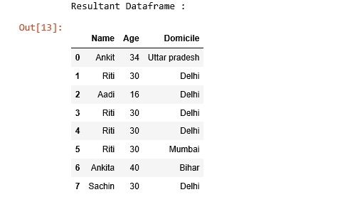

# 如何找到&在熊猫数据框中删除重复的列？

> 原文:[https://www . geesforgeks . org/如何找到-删除-复制-熊猫中的列-数据框/](https://www.geeksforgeeks.org/how-to-find-drop-duplicate-columns-in-a-pandas-dataframe/)

让我们讨论如何在熊猫数据框中查找和删除重复的列。首先，让我们用列名“姓名”、“年龄”、“住所”和“标记”创建一个简单的数据框。

```
# Import pandas library 
import pandas as pd

# List of Tuples
students = [
            ('Ankit', 34, 'Uttar pradesh', 34),
            ('Riti', 30, 'Delhi', 30),
            ('Aadi', 16, 'Delhi', 16),
            ('Riti', 30, 'Delhi', 30),
            ('Riti', 30, 'Delhi', 30),
            ('Riti', 30, 'Mumbai', 30),
            ('Ankita', 40, 'Bihar', 40),
            ('Sachin', 30, 'Delhi', 30)
         ]

# Create a DataFrame object
df = pd.DataFrame(students, columns =['Name', 'Age', 'Domicile', 'Marks'])

# Print a original dataframe
df
```

**输出:**


**代码 1:** 在数据框中查找重复的列。
为了找到重复的列，我们需要遍历数据框的所有列，对于每一列，它将搜索数据框中是否存在任何其他已经具有相同内容的列。如果是，则该列名将存储在重复的列集中。最后，该函数将返回重复列的列名列表。

```
# import pandas library 
import pandas as pd

# This function take a dataframe
# as a parameter and returning list
# of column names whose contents 
# are duplicates.
def getDuplicateColumns(df):

    # Create an empty set
    duplicateColumnNames = set()

    # Iterate through all the columns 
    # of dataframe
    for x in range(df.shape[1]):

        # Take column at xth index.
        col = df.iloc[:, x]

        # Iterate through all the columns in
        # DataFrame from (x + 1)th index to
        # last index
        for y in range(x + 1, df.shape[1]):

            # Take column at yth index.
            otherCol = df.iloc[:, y]

            # Check if two columns at x & y
            # index are equal or not,
            # if equal then adding 
            # to the set
            if col.equals(otherCol):
                duplicateColumnNames.add(df.columns.values[y])

    # Return list of unique column names 
    # whose contents are duplicates.
    return list(duplicateColumnNames)

# Driver code
if __name__ == "__main__" :

    # List of Tuples
    students = [
            ('Ankit', 34, 'Uttar pradesh', 34),
            ('Riti', 30, 'Delhi', 30),
            ('Aadi', 16, 'Delhi', 16),
            ('Riti', 30, 'Delhi', 30),
            ('Riti', 30, 'Delhi', 30),
            ('Riti', 30, 'Mumbai', 30),
            ('Ankita', 40, 'Bihar', 40),
            ('Sachin', 30, 'Delhi', 30)
          ]

    # Create a DataFrame object
    df = pd.DataFrame(students, 
                         columns =['Name', 'Age', 'Domicile', 'Marks'])

    # Get list of duplicate columns
    duplicateColNames = getDuplicateColumns(df)

    print('Duplicate Columns are :')

    # Iterate through duplicate
    # column names
    for column in duplicateColNames :
       print('Column Name : ', column)
```

**输出:**


**代码 2:** 删除数据框中的重复列。
要删除重复的列，我们可以将用户定义函数 getDuplicateColumns()返回的重复列名称列表传递给 [Dataframe.drop()](https://www.geeksforgeeks.org/python-delete-rows-columns-from-dataframe-using-pandas-drop/) 方法。

```
# import pandas library 
import pandas as pd

# This function take a dataframe
# as a parameter and returning list
# of column names whose contents 
# are duplicates.
def getDuplicateColumns(df):

    # Create an empty set
    duplicateColumnNames = set()

    # Iterate through all the columns 
    # of dataframe
    for x in range(df.shape[1]):

        # Take column at xth index.
        col = df.iloc[:, x]

        # Iterate through all the columns in
        # DataFrame from (x + 1)th index to
        # last index
        for y in range(x + 1, df.shape[1]):

            # Take column at yth index.
            otherCol = df.iloc[:, y]

            # Check if two columns at x & y
            # index are equal or not,
            # if equal then adding 
            # to the set
            if col.equals(otherCol):
                duplicateColumnNames.add(df.columns.values[y])

    # Return list of unique column names 
    # whose contents are duplicates.
    return list(duplicateColumnNames)

# Driver code
if __name__ == "__main__" :

    # List of Tuples
    students = [
            ('Ankit', 34, 'Uttar pradesh', 34),
            ('Riti', 30, 'Delhi', 30),
            ('Aadi', 16, 'Delhi', 16),
            ('Riti', 30, 'Delhi', 30),
            ('Riti', 30, 'Delhi', 30),
            ('Riti', 30, 'Mumbai', 30),
            ('Ankita', 40, 'Bihar', 40),
            ('Sachin', 30, 'Delhi', 30)
          ]

    # Create a DataFrame object
    df = pd.DataFrame(students, 
                        columns =['Name', 'Age', 'Domicile', 'Marks'])

    # Dropping duplicate columns
    rslt_df = df.drop(columns = getDuplicateColumns(df))

    print("Resultant Dataframe :")

    # Show the dataframe
    rslt_df
```

**输出:**

