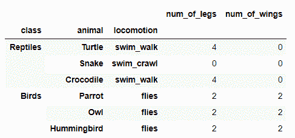

# 如何找到熊猫数据框的横截面？

> 原文:[https://www . geesforgeks . org/如何找到熊猫的横截面-数据框/](https://www.geeksforgeeks.org/how-to-find-the-cross-section-of-pandas-data-frame/)

有时我们需要找到熊猫系列或数据框的横截面。在这里，横截面意味着获得指定索引处的值、多个索引处的值、多个索引和级别处的值或指定列和轴处的值等。有一个功能叫做**熊猫。DataFrame.xs()** 在这种情况下会有所帮助。

**熊猫。DataFrame.xs()** 接受一个关键参数，以便在 MultiIndex 中选择特定级别的数据，并从 pandas 数据框中返回横截面。

> **语法:** DataFrame.xs(键，轴=0，级别=无，drop _ level =真)
> 
> **参数:**
> **键–**标签包含在索引中，或者部分包含在多索引中。
> **轴–**轴检索横截面。
> **级别–**如果键部分包含在多索引中，请指出使用了哪些级别。
> **drop _ level–**如果为 False，则返回与自身具有相同级别的对象。
> 
> **从原始数据框中返回:**
> 横截面

下面是熊猫代码，这将有助于正确理解熊猫。DataFrame.xs()函数。

## 蟒蛇 3

```
# importing pandas library
import pandas as pd

# Creating a Dictionary
animal_dict = {'num_of_legs': [4, 0, 4, 2, 2, 2],

               'num_of_wings': [0, 0, 0, 2, 2, 2],

               'class': ['Reptiles', 'Reptiles', 'Reptiles',
                         'Birds', 'Birds', 'Birds'],

               'animal': ['Turtle', 'Snake', 'Crocodile',
                          'Parrot', 'Owl', 'Hummingbird'],

               'locomotion': ['swim_walk', 'swim_crawl', 'swim_walk', 
                              'flies', 'flies', 'flies']}

# Converting to Data frame and setting index
df = pd.DataFrame(data=animal_dict)
df = df.set_index(['class', 'animal', 'locomotion'])

# Displaying Data frame
df
```

**输出:**



**示例 1:** 获取特定索引的值

## 蟒蛇 3

```
# Using dataframe.xs() function
# to get values of a specific index 
df.xs('Reptiles')
```