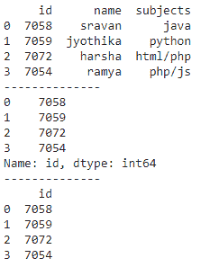
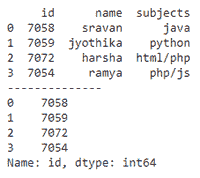

# 如何获取熊猫数据帧的第一列？

> 原文:[https://www . geesforgeks . org/如何获取第一栏熊猫-数据框/](https://www.geeksforgeeks.org/how-to-get-first-column-of-pandas-dataframe/)

在本文中，我们将讨论如何用 Python 编程语言获取 pandas dataframe 的第一列。

## 方法 1:使用[iloc【】](https://www.geeksforgeeks.org/python-extracting-rows-using-pandas-iloc/)功能

此函数用于使用切片运算符获取第一列。对于我们提取的所有行，对于列，指定第一列的索引。

**语法**:

```py
dataframe.iloc[:, 0]
```

哪里？数据帧是输入数据帧

切片操作如下所示:

> [row_start:row_end，column_start，column_end]
> 
> 哪里，
> 
> *   **row_start** 指以 0 位置为索引的起始行
> *   **row_end** 指以第 n 个位置为索引的最后一行
> *   **column_start** 是指以 0 位置为索引的起始列
> *   **column_end** 指第 n 个位置作为索引的最后一列

也可以采用以下替代方案。

**语法:**

```py
dataframe.iloc[:, :1]
```

哪里？dataframe 是输入数据帧。这两者都将返回 dataframe 数据类型。

**示例:** Python 程序使用上述方法获取第一列

## 蟒蛇 3

```py
# import pandas module
import pandas as pd

# create dataframe with 3 columns
data = pd.DataFrame({
    "id": [7058, 7059, 7072, 7054],
    "name": ['sravan', 'jyothika', 'harsha', 'ramya'],
    "subjects": ['java', 'python', 'html/php', 'php/js']
}
)

# display dataframe
print(data)

print("--------------")

# get first column by returning series
print(data.iloc[:, 0])

print("--------------")

# get first column by returning dataframe
print(data.iloc[:, :1])
```

**输出:**



## 方法二:使用[列【】](https://www.geeksforgeeks.org/python-pandas-dataframe-columns/)

此方法将根据索引返回列。所以，我们必须给出 0 来得到第一列

**语法**:

> data frame[data frame . columns[0]]

在哪里

*   数据帧是输入数据帧
*   列[0]表示第一列

**示例** : Python 程序使用 columns[]获取第一列

## 蟒蛇 3

```py
# import pandas module
import pandas as pd

# create dataframe with 3 columns
data = pd.DataFrame({
    "id": [7058, 7059, 7072, 7054],
    "name": ['sravan', 'jyothika', 'harsha', 'ramya'],
    "subjects": ['java', 'python', 'html/php', 'php/js']
}
)

# display dataframe
print(data)

print("--------------")

# get first column by returning dataframe
# using columns[] method
print(data[data.columns[0]])
```

**输出:**



## 方法 3:使用列名

我们可以使用第一列名来获取第一列。

**语法**:

```py
dataframe.first_column
```

**示例:**使用列名获取第一列的 Python 代码

## 蟒蛇 3

```py
# import pandas module
import pandas as pd

# create dataframe with 3 columns
data = pd.DataFrame({
    "id": [7058, 7059, 7072, 7054],
    "name": ['sravan', 'jyothika', 'harsha', 'ramya'],
    "subjects": ['java', 'python', 'html/php', 'php/js']
}
)

# display dataframe
print(data)

print("--------------")

# get first column by returning dataframe
# using column_name
print(data.id)
```

**输出:**


我们也可以在这里使用 [head()](https://www.geeksforgeeks.org/python-pandas-dataframe-series-head-method/) 函数来显示第一列的行数。

**示例:**使用列名获取第一列的 Python 代码

## 蟒蛇 3

```py
# import pandas module
import pandas as pd

# create dataframe with 3 columns
data = pd.DataFrame({
    "id": [7058, 7059, 7072, 7054],
    "name": ['sravan', 'jyothika', 'harsha', 'ramya'],
    "subjects": ['java', 'python', 'html/php', 'php/js']
}
)

# display dataframe
print(data)

print("--------------")

# get first column by returning dataframe
# using column_name
# display 1 row
print(data.id.head(1))
print("--------------")

# get first column by returning dataframe
# using column_name
# display 2 rows
print(data.id.head(2))
print("--------------")

# get first column by returning dataframe
# using column_name
# display 4 rows
print(data.id.head(4))
```