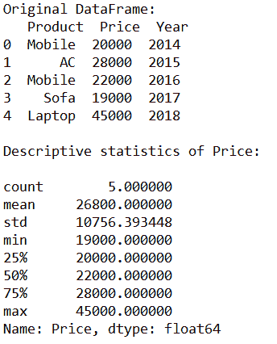
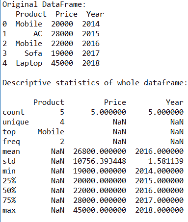
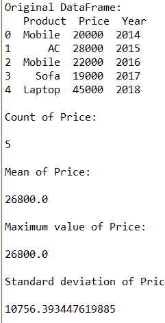

# 如何获取熊猫数据帧的描述性统计？

> 原文:[https://www . geesforgeks . org/如何获取熊猫描述性统计数据-数据框/](https://www.geeksforgeeks.org/how-to-get-the-descriptive-statistics-for-pandas-dataframe/)

`[describe()](https://www.geeksforgeeks.org/python-pandas-dataframe-describe-method/)`Python Pandas 中的方法用于计算描述性统计数据，如计数、唯一值、平均值、标准差、最小值和最大值等。在本文中，让我们学习获取熊猫数据框的描述性统计数据。

> **语法:**
> df['cname']。描述(百分位数=无，包含=无，排除=无)
> 描述(百分位数=无，包含=无，排除=无)
> 
> **参数:**
> **百分位:**表示函数必须返回的百分位值。默认值为 0.25、0.5 和 0.75
> **包含:**代表必须包含的数据类型列表
> **排除:**代表必须排除的数据类型列表

**例 1:**

```
# Import package
from pandas import DataFrame

# Create DataFrame
cart = {'Product': ['Mobile', 'AC', 'Mobile', 'Sofa', 'Laptop'],
        'Price': [20000, 28000, 22000, 19000, 45000],
         'Year': [2014, 2015, 2016, 2017, 2018]
        }
df = DataFrame(cart, columns = ['Product', 'Price', 'Year'])

# Original DataFrame
print("Original DataFrame:\n", df)

# Describing descriptive statistics of Price
print("\nDescriptive statistics of Price:\n")
stats = df['Price'].describe()
print(stats)
```

**输出:**

**例 2:**

```
# Import package
from pandas import DataFrame

# Create DataFrame
cart = {'Product': ['Mobile', 'AC', 'Mobile', 'Sofa', 'Laptop'],
        'Price': [20000, 28000, 22000, 19000, 45000],
         'Year': [2014, 2015, 2016, 2017, 2018]
        }
df = DataFrame(cart, columns = ['Product', 'Price', 'Year'])

# Original DataFrame
print("Original DataFrame:\n", df)

# Describing descriptive statistics of Year
print("\nDescriptive statistics of year:\n")
stats = df['Year'].describe()
print(stats)
```

**输出:**

**例 3:**

```
# Import package
from pandas import DataFrame

# Create DataFrame
cart = {'Product': ['Mobile', 'AC', 'Mobile', 'Sofa', 'Laptop'],
        'Price': [20000, 28000, 22000, 19000, 45000],
         'Year': [2014, 2015, 2016, 2017, 2018]
        }
df = DataFrame(cart, columns = ['Product', 'Price', 'Year'])

# Original DataFrame
print("Original DataFrame:\n", df)

# Describing descriptive statistics of whole dataframe
print("\nDescriptive statistics of whole dataframe:\n")
stats = df.describe(include = 'all')
print(stats)
```

**输出:**

**例 4:**
在本例中，我们单独打印所有的描述性统计数据。

```
from pandas import DataFrame

# Create DataFrame
cart = {'Product': ['Mobile', 'AC', 'Mobile', 'Sofa', 'Laptop'],
        'Price': [20000, 28000, 22000, 19000, 45000],
         'Year': [2014, 2015, 2016, 2017, 2018]
        }
df = DataFrame(cart, columns = ['Product', 'Price', 'Year'])

# Original DataFrame
print("Original DataFrame:\n", df)

# Print Count of Price
print("\nCount of Price:\n")
counts = df['Price'].count()
print(counts)

# Print mean of Price
print("\nMean of Price:\n")
m = df['Price'].mean()
print(m)

# Print maximum value of Price
print("\nMaximum value of Price:\n")
mx = df['Price'].max()
print(m)

# Print standard deviation of Price
print("\nStandard deviation of Price:\n")
sd = df['Price'].std()
print(sd)
```

**输出:**
